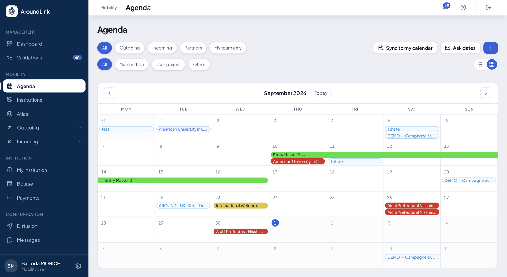

# Agenda

L'agenda rassemble **toutes les dates de votre établissement au même endroit** : semestres,
campagnes, échéances de vos partenaires, étapes d'onboarding, nominations et événements.

Ces dates vivaient jusqu'ici dans cinq écrans différents, et personne ne pouvait répondre
simplement à « qu'est-ce qui tombe le mois prochain ? ».

## Ce que vous y trouvez

**À quoi ça sert.** Voir venir. Une échéance de nomination, la fermeture d'une campagne et
la rentrée d'un partenaire ne sont pas du même ordre, mais elles tombent dans le même mois
et c'est cela qui compte quand on organise son travail.

**Pour qui.** toute l'équipe mobilité

**Comment ça marche.** L'agenda **n'invente aucune date et n'en modifie aucune** : il
assemble ce qui existe déjà ailleurs. Chaque entrée renvoie à l'objet dont elle vient, et
c'est là que la date se modifie — sinon deux versions de la même échéance finiraient par se
contredire.

Vous basculez entre une **vue liste** et une **vue mois**, et vous filtrez sur :

- **la famille** — Semestres, Campagnes, Partenaires, Nomination, Onboarding, Application,
  Autre ;
- **la direction** — sortants ou entrants ;
- **votre équipe seule**, pour écarter ce qui ne vous concerne pas.

Les filtres se cumulent, et la barre de filtres reste sous vos yeux quand la liste défile.

Vous pouvez aussi **ajouter une date** à la main, pour ce qui n'existe nulle part ailleurs :
une réunion de commission, une date limite interne.

*Le mois en cours, chaque date portant la couleur de sa famille. En haut, les filtres qui se cumulent et le bouton d'abonnement à votre calendrier.*

## Retrouver vos dates dans Outlook

**À quoi ça sert.** Consulter les dates d'AroundLink depuis le calendrier que vous utilisez
déjà, sans ouvrir l'outil.

**Pour qui.** toute l'équipe mobilité, et vos étudiants

**Comment ça marche.** AroundLink publie votre agenda dans le format standard que tous les
calendriers savent lire depuis vingt ans. Vous copiez l'adresse d'abonnement, vous la
collez dans Outlook, et vos dates apparaissent — mises à jour toutes seules ensuite.

Ce n'est pas une intégration Microsoft : c'est un format ouvert. **Outlook, Google Agenda,
Apple Calendrier et les autres sont servis de la même façon**, et votre DSI n'a rien à
autoriser ni à configurer.

!!! info "La synchronisation ne va que dans un sens"
    Votre calendrier vient **lire** les dates d'AroundLink. Il ne les modifie pas : une
    échéance de nomination n'a pas à pouvoir être déplacée depuis l'Outlook d'un étudiant.
    Pour changer une date, passez par l'écran d'où elle vient.

**Vous vous abonnez à ce que vous regardez.** L'adresse reprend les filtres affichés au
moment où vous la copiez. Vous pouvez donc créer plusieurs abonnements — « mes
nominations » d'un côté, « les événements de l'équipe » de l'autre — et les voir comme deux
calendriers distincts dans Outlook, que vous affichez ou masquez séparément.

**Ce que le flux contient.** Uniquement des dates et leur intitulé. Aucun nom d'étudiant,
aucune donnée personnelle ne transite par ce canal.

**Cas d'usage.**
> La coordinatrice s'abonne à l'agenda de son équipe filtré sur les sortants. Chaque lundi,
> elle voit dans son Outlook les échéances de la semaine sans ouvrir AroundLink. Quand une
> date change dans l'outil, son calendrier suit.

!!! warning "L'adresse d'abonnement est personnelle"
    Elle donne accès à votre agenda, et à lui seul. Ne la transmettez pas : une personne à
    qui vous la donneriez verrait vos dates. Chacun crée la sienne depuis son propre compte.
