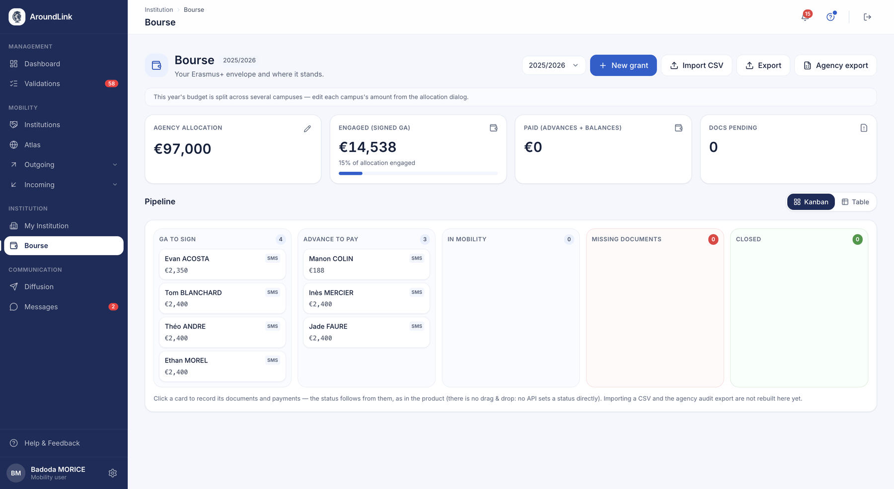

# Mobility grants (Erasmus+)

The Mobility grants module manages your institution's entire Erasmus+ financial side:
annual allocation, grant allocation to students, payment tracking, supporting-document
checklist and export to the official report. Erasmus+ rules (documents conditioning each
payment, budget safeguards, per-country scales) are applied automatically, which
safeguards your audits.

!!! note "Paid-plan module"
    Mobility grants are part of AroundLink's paid offering. The module is only available
    to institutions that have subscribed to that plan.

## Finance dashboard

**What it does.** The module's landing page: a per-academic-year view combining the budget
indicators, grant tracking and the case table, so the office has the Erasmus+ financial
picture in front of them at a single glance.

**Who it's for.** RI manager / coordinator

**How it works.** The coordinator picks the academic year; the dashboard then shows the
allocation, the amounts committed and paid, the remaining budget and the progress of the
grant cases.

*The agency allocation, what is committed and what remains, then each grant tracked by stage: agreement to sign, advance to pay, in mobility, missing documents, closed.*

**Use case.**
> At the start of the year, the coordinator opens the dashboard and sees at a glance how
> much of the allocation is already committed and how much remains available.

## Erasmus+ allocation (budget)

**What it does.** Records the institution's total Erasmus+ allocation for the academic
year and shows consolidated figures in real time — allocation, amount committed to grants,
amount actually paid, remaining balance — so the office never over-commits its funding.

**Who it's for.** RI manager / coordinator

**How it works.** The coordinator enters the allocation amount for the year; the module
automatically computes and shows the committed amount, the paid amount and the remaining
balance, consolidated at the institution level (all campuses combined).

**Use case.**
> The coordinator records a €120,000 allocation; as grants are created, the dashboard
> shows €80,000 committed, €45,000 paid, €40,000 remaining.

## Grant management and lifecycle

**What it does.** The central grant record: one record per student per year, carrying the
mobility type, dates, attributed amount, payments and the 7-item Erasmus+ checklist. Its
status advances automatically as signatures and payments come in, so the office always
knows where each case stands without manual bookkeeping.

**Who it's for.** RI manager / coordinator

**How it works.** The coordinator creates a grant for a student, enters the mobility type,
dates and amount. The status is not set by hand: the case starts "awaiting agreement",
then moves on its own to "active" once the grant agreement and the learning agreement are
signed and the advance is paid, to "documents awaited" at the end of the mobility, and
closes once all final documents are received.

**Use case.**
> The coordinator creates a grant for a study mobility to Berlin; as the grant agreement
> and the learning agreement are signed and the advance paid, the grant moves on its own
> to "active", then closes itself once the certificate of attendance, the transcript and
> the final report are received.

## Budget safeguards

**What it does.** Prevents the office from allocating more grants than the Erasmus+
allocation allows, including when two coordinators act at the same time. Clearly
distinguishes "allocation not set" (action needed) from "allocation exhausted".

**Who it's for.** RI manager / coordinator

**How it works.** When creating or editing a grant, the module checks that the requested
amount does not exceed the remaining balance and blocks the operation if it would, with an
explicit message. Only increases in commitment are blocked: correcting an amount downward
or clearing it always remains possible.

**Use case.**
> Two coordinators try at the same time to add €5,000 grants when only €6,000 remain: the
> first goes through, the second is rejected with "insufficient budget".

## Payment conditions

**What it does.** Applies the Erasmus+ rules that condition each payment tranche, so the
office cannot record a payment before the required documents exist. Protects compliance in
the event of an inspection.

**Who it's for.** RI manager / coordinator

**How it works.** When recording a payment, the module blocks an increase of the advance
as long as the grant agreement and the learning agreement are not signed, and an increase
of the balance as long as the certificate of attendance and the final report are not
received. It also ensures no payment is entered without an attributed amount and that the
total paid does not exceed the attributed amount.

**Use case.**
> The coordinator tries to record the advance before the learning agreement is signed:
> "Advance payment blocked — the grant agreement and the learning agreement must be signed
> first".

## Grant amount calculation

**What it does.** Computes the suggested grant amount from the official Erasmus+ scale
(per-country monthly rate × duration, or daily rate for blended intensive programmes), so
the office no longer computes amounts by hand and stays aligned with the national agency
rates, revised every year.

**Who it's for.** RI manager / coordinator

**How it works.** During entry, the module proposes an amount in real time from the
institution, the mobility type and the dates. For a study or traineeship mobility, the
calculation applies the host country's monthly rate to the duration; for a blended
intensive programme, a daily rate to the duration in days.

**Use case.**
> The coordinator enters a study mobility to Germany from 01/09 to 31/12; the form
> instantly shows the suggested amount, computed from the country-group rate and 4 months.

## Grant CSV import

**What it does.** Lets the office create many grants at once from a spreadsheet, rather
than one by one, with a "check then confirm" flow that flags errors and warnings line by
line and refuses any breach of the allocation.

**Who it's for.** RI manager / coordinator

**How it works.** The coordinator downloads a template file, fills it in, uploads it for
preview — they get a per-line report (errors, warnings, suggested amount if the cell is
empty) — then confirms to create the valid grants. An invalid line does not prevent the
others from being imported.

**Use case.**
> The coordinator imports 40 grants from a spreadsheet; 3 lines flag a breach of the
> allocation and are set aside, 37 are created.

## Export (Beneficiary Module) and audit log

**What it does.** Produces the rich CSV the office needs to report mobilities into the
Erasmus+ Beneficiary Module (official organisation identities, ISCED subject area,
participant data, unique mobility ID, distance band, derived indicators), as well as an
export of the change log (who changed what, when) for internal audit.

**Who it's for.** RI manager / coordinator ; finance and compliance

**How it works.** The coordinator exports, for the chosen year, the grants CSV ready to be
reported into the Beneficiary Module, and separately the audit log that traces each change
with its author and date.

**Use case.**
> At reporting time, the coordinator exports the year's grants to report them into the
> Beneficiary Module, and pulls the audit log for the internal auditor.

## Eligible-student picker

**What it does.** When creating a grant, only proposes students actually eligible for an
Erasmus+ grant (active affectation to a programme country covered by the scale) and flags
those who already have a grant, to avoid invalid or duplicate cases.

**Who it's for.** RI manager / coordinator

**How it works.** In the creation window, the module shows the list of eligible students
for the year and the institution, each with the suggested mobility type, the host
institution, and an indication of whether they already have a grant.

**Use case.**
> In the "new grant" window, the coordinator sees only the 22 eligible students; 3 already
> have a grant and are flagged as such.

