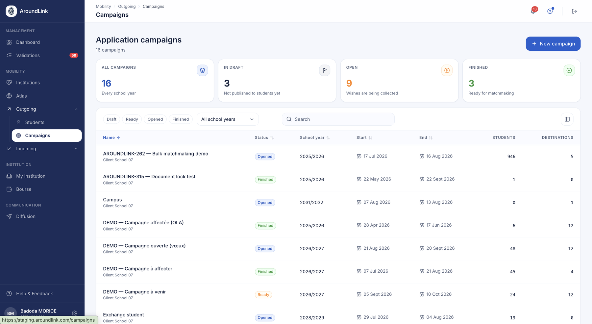
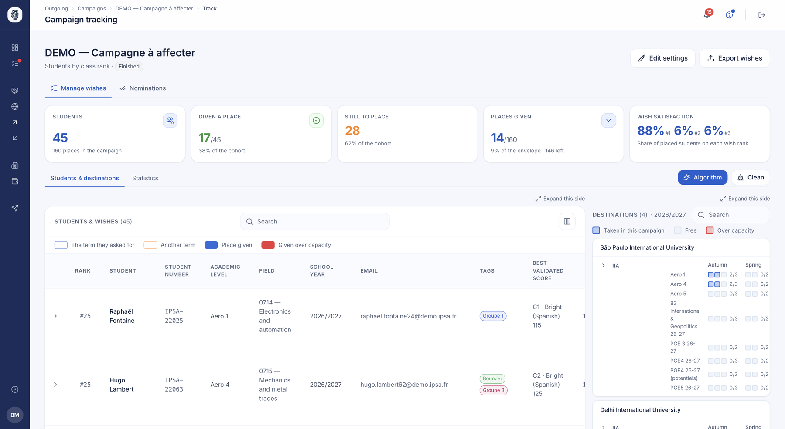
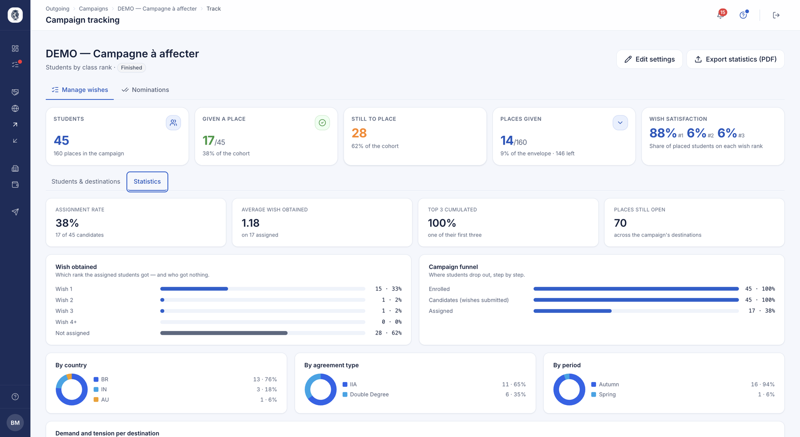
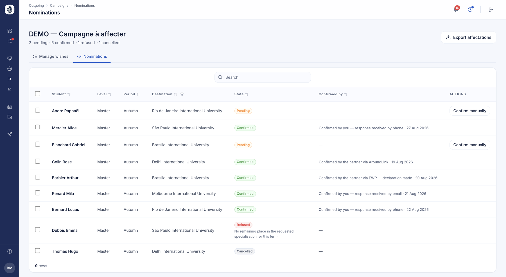

# Mobility campaigns

The Campaigns module structures application rounds: eligible students rank a set number
of wishes among the catalogue's offers, and the IRO drives the whole thing — from opening
to final placement — without rebuilding the list by hand.

## Mobility campaigns

**What it's for.** Lets an international relations office run a framed application round,
where students rank a fixed number of exchange wishes within a given window. The campaign
automatically determines which students and which partner offers belong to it, avoiding
hand-picking each participant.

**Who it's for.** IRO manager / coordinator

**How it works.** The coordinator creates a campaign by choosing the academic year, the
number of allowed wishes, the target academic levels, the mobility periods, the eligible
agreement types and an optional partner-tag filter. On save, the system builds the pool of
participating students and the pool of eligible offers from those criteria. The campaign
moves from Draft to Ready (opening it to students), then Opened and Finished; only a draft
campaign remains editable.

*Your campaigns, whatever their status. The four counters at the top give you the state of play at a glance. Click the image to enlarge it.*

**Use case.**
> The IRO opens a "2026/2027 – Semester 1 – Master" campaign, 5 wishes allowed, restricted
> to Erasmus+ partners tagged "Engineering"; every Master student with a Semester 1 period
> is enrolled automatically.

??? note "Internal details (AroundLink team)"
    `Campaign` entity: `wishesNumber`, `academicLevels`, `periods` (M2M `MobilityPeriod`),
    `agreementTypes` (`AgreementTypeEnum`), `requiredFileTypes` (documents to have validated
    before submitting wishes), `filterPartnerTags`. Status `CampaignStatusEnum{DRAFT, READY,
    OPENED, FINISHED}`. `CampaignManager::handleCampaign()` rebuilds relations on every
    create/edit. Selection via `AcademicLevelResolver::expandLevelsToEqfSiblingValues()` (a
    level pulls its EQF siblings); an exchange with no places across the campaign's periods
    is dropped.

## Wishes, proposals and placements

**What it's for.** Turns each student's ranked wish list into a confirmed placement,
respecting real place availability and student rank. Automates the "who goes where"
allocation offices otherwise run on spreadsheets, while letting the coordinator adjust and
the student accept or refuse.

**Who it's for.** coordinator / student

**How it works.** Students submit an ordered wish list. The coordinator launches automatic
allocation, which processes students by rank (GPA) and offers each the first wish that
still has a place for their period; those who can't be placed are flagged. The coordinator
can then pre-assign (override), refuse or cancel a proposal — each action recalculates the
rest — then send proposals to students, who accept (creating a nomination to the partner)
or refuse (which cancels their other wishes and frees the place). When a proposal is sent
or a student is placed, they can be notified — by email and/or in the app; these
notifications are configurable and can be turned off by the institution.

*The placement screen. Ranked students with their wishes on the left, destinations and remaining places by level and period on the right. The colour code separates the term asked for, another term, a place given, and an over-capacity assignment.*

**Use case.**
> Two students rank Berlin as wish #1: the higher-ranked one (GPA) gets the proposal, the
> other automatically rolls to their wish #2. The coordinator then pre-assigns a special
> case, and the system redistributes the freed place.

??? note "Internal details (AroundLink team)"
    `CampaignWish.status` = `WishStatusEnum{DRAFT_STUDENT, SUBMITTED_BY_STUDENT,
    SYSTEM_PROPOSAL, SYSTEM_NOT_ENOUGH_PLACES, COORDINATOR_PROPOSAL,
    COORDINATOR_PROPOSAL_SENT_TO_STUDENT, ACCEPTED_BY_STUDENT, REFUSED_BY_COORDINATOR,
    REFUSED_BY_STUDENT, CANCELLED_AFTER_REFUSAL}`. Place accounting via `MobilitySpecPlaces`
    (per-period counter). `MatchmakingService` processes students by rank. On accept,
    `CampaignWishesManager::acceptWish()` reuses or creates an `ExchangeAffectation` at
    status `PENDING` (EWP nomination to the partner), within a transaction; the wish ↔
    affectation link is unique. A re-nomination after refusal/cancellation returns to
    `PENDING` and never downgrades an `APPROVED`. The `matchMakingCompleted` flag prevents
    re-running the global allocation.

## Tracking, results and exports

**What it's for.** Gives the coordinator an operational dashboard of the running campaign
(who submitted, who's placed, dossier completeness), results and accepted views, plus CSV
exports for downstream processing. A campaign becomes a traceable, usable process.

**Who it's for.** IRO manager / coordinator

**How it works.** The tracking page aggregates participants, their wishes by rank, proposals
and placements, with charts and a completed-dossier counter. Wishes are also grouped by
**geographic zone** — Europe, North America, Latin America, Asia-Oceania, Africa, Middle
East — so you can read at a glance where demand is going. Dedicated pages present results
and accepted students, and two exports produce the all-wishes list and the final-assignments
list.

**Counter accuracy.** Destination and institution counts only include what is genuinely open
to students: hidden or archived partners are excluded, as are destinations with no place
available. The figures shown match what the student will see.

*A campaign's statistics: which wish rank placed students got, the campaign funnel step by step, and breakdowns by country, agreement type and period.*

**Use case.**
> Mid-round, the coordinator sees 60% of students have submitted their wishes and 12 are
> placed; after closing, they export the final assignments for the mobility team.

??? note "Internal details (AroundLink team)"
    `trackCampaign()`: charts via `ChartBuilderInterface`, wishes grouped by rank,
    completeness derived from existing proposals/placements. Exports via
    `CampaignExportService` (`exportAllWishes`, `exportFinalAssignments`). Live preview
    (`/preview`) for the create-form counters.

## Nominating to your partners

**What it's for.** Officially telling the host institution you are sending them a student,
then recording their answer.

**Who it's for.** IRO manager / coordinator

**How it works.** Each row is a student assigned to a destination. You nominate them, and
the partner is informed. When they reply, you record their decision, stating how it reached
you: the platform, the EWP network, an email or a phone call. A refusal comes with its
reason, and a nomination can be cancelled as long as it is not confirmed.

*Each nomination's state and, for confirmed ones, how the answer came in.*

**Use case.**
> The coordinator nominates twelve students; eight confirmations come back through the
> platform or EWP, two by phone which they record by hand, and one destination refuses for
> lack of a place in the requested specialisation.

!!! note "Document reminders"
    Automatic reminders to students with an incomplete dossier are covered by
    [document reminders](communications.md).
