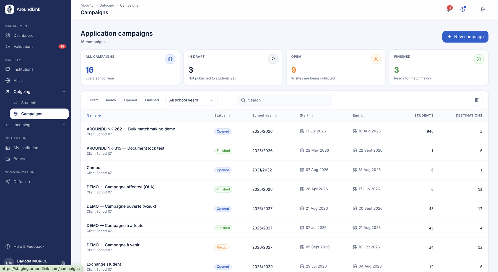
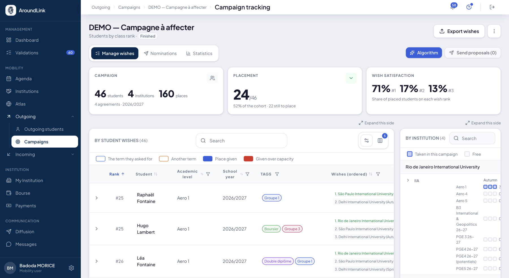
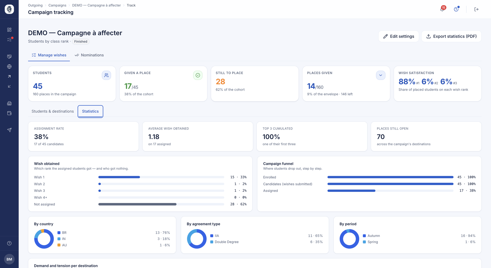
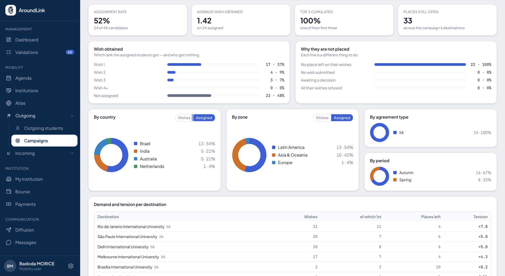
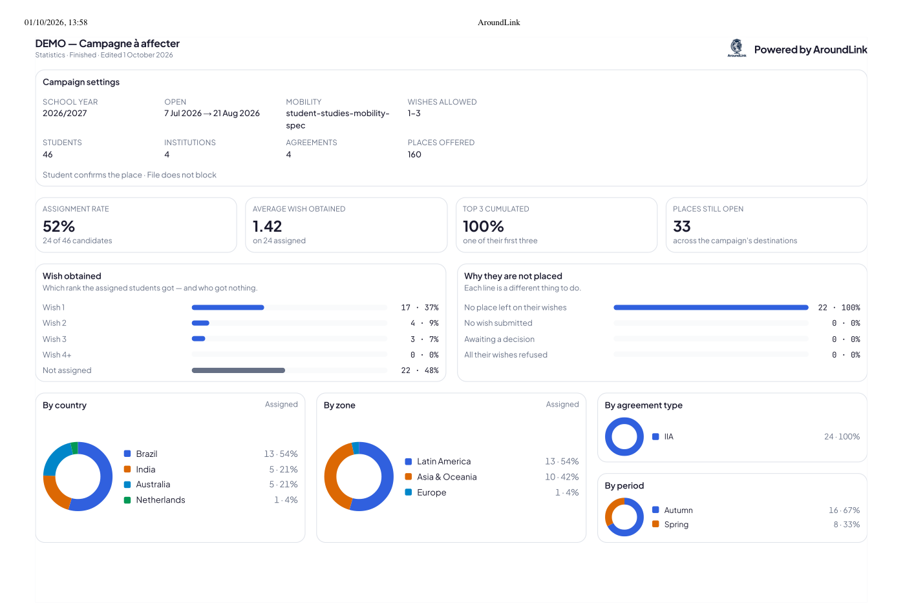
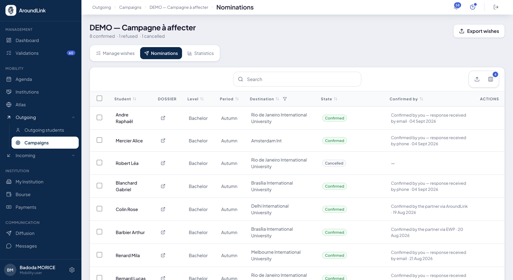

# Campagnes de mobilité

Le module Campagnes structure les sessions de candidature : les étudiants éligibles
classent un nombre défini de vœux parmi les offres du catalogue, et le bureau RI pilote
l'ensemble — de l'ouverture au placement final — sans reconstituer la liste à la main.

## Campagnes de mobilité

**À quoi ça sert.** Permet à un bureau des relations internationales d'organiser une
session de candidature cadrée, où les étudiants classent un nombre fixe de vœux d'échange
dans une période donnée. La campagne détermine automatiquement quels étudiants et quelles
offres partenaires en font partie, ce qui évite de sélectionner chaque participant
manuellement.

**Pour qui.** gestionnaire RI / coordinateur

**Comment ça marche.** Le coordinateur crée une campagne en choisissant l'année
universitaire, le nombre de vœux autorisés, les niveaux d'études visés, les périodes de
mobilité, les types d'accords éligibles et un filtre optionnel par tag de partenaire. À
l'enregistrement, le système constitue automatiquement le vivier d'étudiants participants
et le vivier d'offres éligibles selon ces critères. La campagne passe de Brouillon à
Prête (ouverture aux étudiants), puis Ouverte et Terminée ; seule une campagne en
brouillon reste modifiable.

**La date de fin clôt la campagne d'elle-même.** Le lendemain de son dernier jour, la
campagne passe en Terminée sans que personne ait à cliquer : les vœux encore à l'état de
brouillon deviennent des vœux, vos étudiants sont prévenus et vous recevez le bilan —
exactement ce que fait le bouton « Terminer ».

Si la clôture vous paraît prématurée, le bouton « Rouvrir » rend à vos étudiants le droit
de modifier leurs vœux. Pensez alors à repousser la date de fin : sans cela, la campagne se
refermera dès le lendemain matin.

*Vos campagnes, tous statuts confondus. Les quatre compteurs du haut donnent l'état du parc en un coup d'œil. Cliquez sur l'image pour l'agrandir.*

**Cas d'usage.**
> Le bureau RI ouvre une campagne « 2026/2027 – Semestre 1 – Master », 5 vœux autorisés,
> limitée aux partenaires Erasmus+ tagués « Ingénierie » ; tous les étudiants de Master
> avec une période Semestre 1 sont inscrits automatiquement.

## Paramétrer une campagne, réglage par réglage

**À quoi ça sert.** Comprendre ce que change chaque réglage avant de l'activer — plusieurs
d'entre eux ne se reviennent pas une fois que vos étudiants ont commencé à répondre.

**Pour qui.** gestionnaire RI / coordinateur

### L'identité

**Nom**, **année scolaire**, **date de début** et **date de fin**. La fin ne peut pas
précéder le début, et elle n'est pas décorative : le lendemain du dernier jour, la campagne
se clôt d'elle-même.

### Le vivier d'étudiants

Qui participe. Vous combinez autant de critères que nécessaire :

- **Niveau d'études** et **parcours** — le parcours est le libellé que vous avez donné à vos
  promotions (« Aero 4 », « PGE 26-27 ») ;
- **Campus** — ou tous ;
- **Tags généraux** et **filtres étudiants** ;
- des **ajouts manuels**, étudiant par étudiant, pour les cas particuliers.

### Le vivier de destinations

Où ils peuvent partir :

- **Types d'accord** — échange, double diplôme, mobilité payante, stage ;
- **Type de mobilité** — y compris les mobilités de personnel, enseignement et formation ;
- **Périodes** ;
- **Partenaires** — tous, ou restreints par vos tags et filtres d'établissement.

Là aussi, vous pouvez ajouter ou retirer un accord à la main.

### Les vœux

**Minimum** et **maximum**, tous deux facultatifs. Le minimum bloque autant que le maximum :
un étudiant qui n'a pas atteint le nombre demandé ne peut pas valider sa liste.

### Le dossier de l'étudiant

Vous désignez les **documents requis**, puis vous choisissez ce qui se passe quand il en
manque un :

- **Le montrer et affecter quand même** *(recommandé)* — le manque est signalé, la décision
  reste la vôtre ;
- **Bloquer l'affectation** tant que tout n'est pas là.

### L'étudiant peut-il dire qu'il ne part pas ?

- **Non** — une liste de vœux vide veut simplement dire « pas encore répondu » ;
- **Oui** — il peut déclarer qu'il ne souhaite pas partir. Il répond une fois, **aucun motif
  ne lui est demandé**, et il cesse aussitôt d'apparaître dans vos relances et dans le
  matchmaking. Sa réponse reste réversible tant que la campagne est ouverte.

!!! warning "Ce réglage ne se rattrape pas en cours de route"
    Une campagne qui n'a jamais posé la question ne se met pas à la poser seule. Et une fois
    que des réponses sont arrivées, il n'est plus possible de revenir en arrière — sans quoi
    des décisions déjà prises par vos étudiants deviendraient illisibles.

### Qui confirme la destination

- **L'étudiant accepte ou refuse** la proposition ;
- **Le coordinateur affecte directement** — l'étape d'acceptation disparaît, votre décision
  crée l'affectation.

### La note aux étudiants

Un texte libre, facultatif, affiché à ceux qui participent.

### L'aperçu avant d'enregistrer

Avant de valider vos changements, un récapitulatif vous dit ce que la sauvegarde va
**ajouter, conserver et retirer** — destinations comme étudiants. Retirer un partenaire
emporte tous ses accords de la campagne, et les vœux déjà posés dessus : l'aperçu vous le
dit avant, pas après.

## Ce que le matchmaking exige

**À quoi ça sert.** Savoir ce qu'il faut avoir préparé pour qu'un tour d'affectation puisse
tourner — et pourquoi il refuse parfois de démarrer.

**Pour qui.** gestionnaire RI / coordinateur

**Comment ça marche.** Le moteur place chaque étudiant sur la case de **son propre
parcours** — « Aero 4 » n'est pas « Aero 5 » — et il ne devine jamais. Trois conditions sont
donc exigées de chaque participant :

| Condition | Pourquoi |
|---|---|
| **Un profil** | Sans dossier, il n'y a rien à placer. |
| **Un parcours** | C'est lui qui désigne la case. Sans parcours, aucune case ne lui correspond. |
| **Un classement importé** | Le tour est un **ordre** : il sert le premier classé, et ce qui reste va au suivant. Sans rang, l'étudiant n'a pas de place dans cet ordre. |

Un participant à qui il manque l'une des trois est **écarté et nommé** dans le compte rendu,
avec la raison. Le tour ne part pas en silence.

!!! warning "Le parcours est exigé même si vous n'en utilisez pas"
    Si votre établissement ne distingue pas de promotions, donnez-vous un parcours par
    niveau utilisé — « Licence », « Master ». Un seul mécanisme porte alors tous les cas, et
    rien n'est jamais déduit à votre place.

!!! info "Le classement s'importe avant, jamais pendant"
    Le tour ne fabrique pas de classement. Importez-le d'abord ; sinon les étudiants sans
    rang seraient servis en dernier, ce qui serait une décision que personne n'a prise.

**Rien de tout cela ne vous contraint à la main.** Vous restez libre d'affecter qui vous
voulez, où vous voulez, classé ou non : c'est votre décision, et le moteur ne s'y oppose
pas. Ces trois conditions ne valent que pour le tour automatique.

Un tour peut être relancé autant de fois que nécessaire — ce n'est pas un geste unique.

## Vœux, propositions et affectations

**À quoi ça sert.** Transforme la liste de vœux classés de chaque étudiant en une
affectation confirmée, en respectant les places réellement disponibles et le rang de
l'étudiant. Automatise l'attribution « qui va où » que les bureaux gèrent sinon sur
tableur, tout en laissant le coordinateur ajuster et l'étudiant accepter ou refuser.

**Pour qui.** coordinateur / étudiant

**Comment ça marche.** Les étudiants soumettent une liste de vœux ordonnée. Le
coordinateur lance l'attribution automatique, qui traite les étudiants par rang (GPA) et
propose à chacun le premier vœu disposant encore d'une place sur sa période ; ceux qui ne
peuvent être placés sont signalés. Le coordinateur peut ensuite pré-affecter (forcer),
refuser ou annuler une proposition — chaque action recalcule le reste — puis envoyer les
propositions aux étudiants, qui acceptent (créant une nomination auprès du partenaire) ou
refusent (ce qui annule leurs autres vœux et libère la place). Quand une proposition est
envoyée ou qu'un étudiant est affecté, celui-ci peut être prévenu — par e-mail et/ou dans
l'application ; ces notifications sont paramétrables et peuvent être désactivées par
l'établissement.

*Le suivi d'une campagne : en tête, ce qu'elle contient, ce qui est placé et la satisfaction des vœux ; en dessous, vos étudiants dans l'ordre du classement, avec leurs vœux tels qu'ils les ont rangés.*

**Cas d'usage.**
> Deux étudiants classent Berlin en vœu n°1 : le mieux classé (GPA) reçoit la proposition,
> l'autre bascule automatiquement sur son vœu n°2. Le coordinateur pré-affecte ensuite un
> cas particulier, et le système redistribue la place libérée.

## Ce que le tour d'affectation a fait

**À quoi ça sert.** Savoir précisément ce qu'un tour d'affectation a placé, ce qu'il n'a
pas pu placer, et **qui** il a laissé de côté.

**Pour qui.** gestionnaire RI / coordinateur

**Comment ça marche.** À la fin du tour, un compte rendu vous dit combien d'étudiants ont
été servis et lesquels ont été écartés. Les étudiants écartés sont **nommés**, avec la
raison — un simple total vous obligerait à parcourir toute la promotion pour les retrouver.

Quatre raisons peuvent écarter un étudiant :

- il n'a **pas de profil** ;
- son niveau n'a **aucun parcours** rattaché ;
- il n'a **pas de classement** ;
- son **dossier est incomplet**.

Un tour qui ne place personne le dit maintenant clairement, au lieu de s'annoncer terminé.

**Cas d'usage.**
> Le coordinateur lance le tour et lit le compte rendu : quarante-deux étudiants placés,
> trois écartés faute de classement. Il les nomme, importe leur rang, et relance le tour.

## Suivi, résultats et exports

**À quoi ça sert.** Offre au coordinateur un tableau de bord opérationnel de la campagne
en cours (qui a soumis, qui est placé, complétude des dossiers), des vues résultats et
acceptés, ainsi que des exports CSV pour la suite du traitement. Une campagne devient un
processus traçable et exploitable.

**Pour qui.** gestionnaire RI / coordinateur

**Comment ça marche.** La page de suivi agrège les participants, leurs vœux par rang, les
propositions et affectations, avec des graphiques et un compteur de dossiers complets. Les
vœux sont également regroupés par **zone géographique** — Europe, Amérique du Nord, Amérique
latine, Asie-Océanie, Afrique, Moyen-Orient — pour lire d'un coup d'œil où se porte la
demande. Des pages dédiées présentent les résultats et les acceptés, et deux exports
produisent la liste de tous les vœux et celle des affectations finales.

**Fiabilité des compteurs.** Les décomptes de destinations et d'établissements ne retiennent
que ce qui est réellement ouvert aux étudiants : les partenaires masqués ou archivés en sont
exclus, tout comme les destinations sans place disponible. Les chiffres affichés
correspondent donc à ce que l'étudiant verra.

*Les statistiques d'une campagne : le rang de vœu obtenu par les étudiants placés, l'entonnoir de la campagne étape par étape, et les répartitions par pays, type d'accord et période.*

**Cas d'usage.**
> À mi-parcours, le coordinateur constate que 60 % des étudiants ont soumis leurs vœux et
> que 12 sont placés ; après clôture, il exporte les affectations finales pour l'équipe
> mobilité.

## Les statistiques d'une campagne

**À quoi ça sert.** Savoir où en est une campagne, pourquoi des étudiants ne sont pas
placés, et sortir un rapport présentable en commission.

**Pour qui.** gestionnaire RI / coordinateur

**Comment ça marche.** Les statistiques ont leur **propre adresse** : un onglet à part
entière, au même niveau que la gestion des vœux et les nominations. Vous pouvez donc
envoyer le lien à un collègue, et il arrivera sur les mêmes chiffres.

Tout ce qui s'affiche vient de **la même source que l'écran d'affectation**. Les tableaux
et les graphiques ne peuvent pas se contredire.

**Les chiffres de tête.** Le taux d'affectation, le vœu moyen obtenu, et la répartition de
ceux qui restent : en attente d'une décision, tous vœux refusés, mobilité déclinée, annulé.
Chaque ligne est une chose différente à faire — ce n'est pas le même geste de relancer un
étudiant qui attend et un étudiant dont tous les vœux ont été refusés.

**Les répartitions.** Par type d'accord, par pays, par zone, par période.

**La demande et la tension par destination** : où l'on se bouscule, et où il reste de la
place.

!!! note "Deux règles qui évitent de se mentir"
    Le **vœu moyen obtenu** se calcule sur les étudiants **affectés seulement**. Dire
    « 80 % ont eu leur premier vœu » en comptant tout le monde flatterait une campagne qui
    n'a placé personne.

    Une **répartition de moins de cinq étudiants ne s'affiche pas**. Sur une petite
    promotion, un pourcentage est une personne : il se lit comme une tendance alors que
    c'est une anecdote.

*Les quatre chiffres de tête, le vœu obtenu par rang, « pourquoi ils ne sont pas placés », puis les répartitions par pays, zone, type d'accord et période — et la tension destination par destination.*

**Le rapport s'imprime.** L'en-tête rappelle les réglages de la campagne — année scolaire,
dates d'ouverture, type de mobilité, nombre de vœux autorisés, qui confirme la destination,
dossier bloquant ou non — et se répète en haut de chaque page, avec votre logo et la date.
Les graphiques survivent à l'impression, et un bloc qui ne tient pas descend à la page
suivante au lieu d'être coupé.

*Le rapport tel qu'il sort : les réglages de la campagne en tête, les quatre chiffres, le rang de vœu obtenu, les raisons de non-placement, et les répartitions.*

**L'export de données.** À côté du rapport, un classeur de trois feuilles :

| Feuille | Ce qu'elle contient |
|---|---|
| **Students** | Une ligne par étudiant : rang de classement, identité, niveau, parcours, année, scores de langue, puis **chaque vœu** avec son code, son université, sa ville, son pays, son type de place et sa période |
| **By university** | La même campagne vue par destination |
| **Final assignments** | Les affectations retenues |

Le rapport sert à montrer, le classeur à retravailler : l'un part en commission, l'autre
dans un tableur.

**Cas d'usage.**
> Avant la commission, la coordinatrice ouvre les statistiques, imprime le rapport en PDF et
> le joint à sa convocation. Les membres arrivent en ayant vu les mêmes chiffres qu'elle, et
> la discussion porte sur les douze étudiants non placés plutôt que sur la lecture des
> tableaux.

## Nominations chez vos partenaires

**À quoi ça sert.** Prévenir officiellement l'établissement d'accueil que vous lui envoyez
un étudiant, puis consigner sa réponse.

**Pour qui.** gestionnaire RI / coordinateur

**Comment ça marche.** Chaque ligne est un étudiant affecté à une destination. Vous le
nominez, et le partenaire reçoit l'information. Quand il répond, vous enregistrez sa
décision en précisant par quel canal elle vous est parvenue : la plateforme, le réseau EWP,
un e-mail ou un appel. Un refus s'accompagne de son motif.

L'onglet apparaît dès qu'une place est tenue dans la campagne. Vous pouvez nominer toute une
sélection d'un seul geste : le lot se traite par tranches, son avancement reste visible, et
un lot interrompu reprend là où il s'est arrêté au lieu de repartir de zéro.

Tant que le partenaire n'a pas répondu, deux actions vous évitent de sortir de l'outil :

- **Relancer** — un rappel part chez le partenaire sans passer par votre boîte mail. Une
  relance par vingt-quatre heures : le bouton se grise ensuite.
- **Retirer** — vous annulez la nomination en expliquant pourquoi. Le partenaire est prévenu
  qu'aucune décision n'est plus attendue, et l'étudiant redevient disponible pour une autre
  destination.

*L'état de chaque nomination, et pour les confirmées, comment la réponse est arrivée.*

**Cas d'usage.**
> Le coordinateur nomine douze étudiants ; huit confirmations reviennent par la plateforme
> ou par EWP, deux par téléphone qu'il saisit à la main, et une destination refuse faute de
> place dans la spécialité demandée.

!!! note "Relances documentaires"
    Les rappels automatiques aux étudiants dont le dossier est incomplet sont couverts par
    les [relances documentaires](communications.md).
