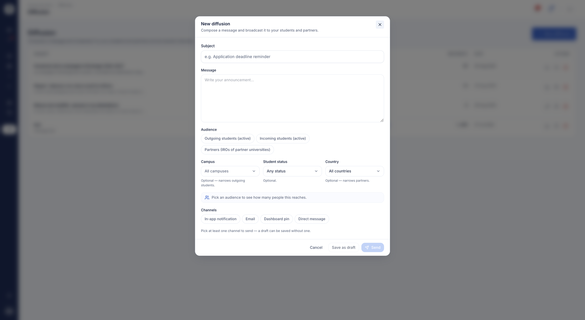

# Communications & notifications

This module brings together everything about the International Relations Office's
communication: broadcasting a message to a targeted audience, notifying in real
time, chatting directly with a student or partner, and automatically chasing
missing documents. The goal: replace scattered manual emailing with integrated,
tracked tools.

## Broadcast messaging

**What it's for.** You write a message once and broadcast it across several
channels — in-app notification, email, dashboard pin, direct message — to targeted
audiences. No more manual mail-merge: you target, you send, and you keep a record.

**Who it's for.** coordinator / IR manager

**How it works.** The composer lets you choose the audiences (outgoing students,
incoming students, partners) and optional filters (country, campus, student access
status), with a live recipient counter before sending. You can also start from an
**explicit selection**: tick the students you want in your list, or the contacts
you want in your directory, and send to those alone — useful when the group you
have in mind matches no filter. You select the channels you want, you can save a
draft, and a sent message is locked. On send, a receipt shows
the number of recipients, emails sent and pinned messages. A pinned message can
later be removed from the dashboard.

*Composing a broadcast: subject, message, target audience, optional filters and sending channels.*

**Use case.**
> A coordinator sends "Nomination deadline extended to March 15" to all outgoing
> students in Spain, pinned to their dashboard and sent by email.

??? note "Internal details (AroundLink team)"
    Audiences: `outgoing_students` / `incoming_students` / `partners`. Channels:
    in_app / email / dashboard_pin / direct_message. Email delivery is tracked per
    recipient (status queued / sent / opened / clicked / bounced). The composer
    warns before replacing an existing pin. Ownership checked before edit / delete
    / unpin; a sent message can no longer be edited. Controller:
    `CommunicationController`, entities `Communication` / `CommunicationEmailLog`.
    AROUNDLINK-509.

## In-app notifications

**What it's for.** Every user has a notification feed with a live unread counter in
the top bar. Coordinators, partners and students stay informed of new messages and
events without relying on email.

**Who it's for.** coordinator / partner / student

**How it works.** The bell shows the number of unread notifications; opening one
marks it read, and a button lets you mark all read at once. A notification can link
back to its source message.

**Use case.**
> A student sees a "3" on the bell, opens it and finds their Learning Agreement has
> just been approved.

??? note "Internal details (AroundLink team)"
    History feed + a count endpoint polled by the bell + read-on-open + "mark all
    read." The `Notification` entity can be linked to a `Communication`.
    Controllers: `NotificationController` (mobility) and
    `StudentNotificationController` (student). AROUNDLINK-509 / -511.

## Direct messaging

**What it's for.** Private threaded messaging between the three actor types — IR
team, students, AroundLink team. Questions get settled inside the platform rather
than through scattered emails.

**Who it's for.** coordinator / student / partner

**How it works.** Each profile has its own inbox: a conversation list, a one-to-one
thread with read-on-open, reply, and a "new message" picker to start an exchange.
An unread counter shows in the top bar.

**Use case.**
> An incoming student writes to the host office with a housing question; the
> coordinator replies in the thread.

??? note "Internal details (AroundLink team)"
    Shared `Conversation` / `Message` entities and the same templates across the
    three controllers (`MessageController` on the mobility, admin and student
    sides). Thread ids in UUID format. AROUNDLINK-147.

## Document reminder campaigns

**What it's for.** Automated, tracked reminder-email campaigns nudge students to
submit their missing documents, with open, click and bounce statistics per
campaign. Chasing documents becomes a measurable, one-click operation.

**Who it's for.** coordinator / IR manager

**How it works.** A campaign targets students by document type, study level and
related campaigns. The campaign list and a statistics window show the number of
emails sent, the open rate, the click rate and the delivery rate. Emails then go
out automatically as a background task.

**Use case.**
> A coordinator launches a reminder for all Master students missing their Learning
> Agreement, then checks a 62% open rate in the statistics window.

!!! tip "From campaigns"
    Reminders can also be triggered from the document tracking of a
    [campaign](../etablissement/campagnes.md): it's the same reminder mechanism
    documented here.

??? note "Internal details (AroundLink team)"
    One `ReminderLine` per student tracks send / open / click / bounce. Async
    sending via the `reminder-campaigns:send-pending-emails` command (processes
    lines where `sentAt IS NULL`). Open/click/bounce tracking updated on the email
    provider side. Controller: `ReminderCampaignController`; created via
    `CreateReminderCampaign` from student-document tracking.

## Feedback request reminders

**What it's for.** Prompt students who have not yet left a review about their host
institution, on the same principle as document reminders.

**Who it's for.** coordinator / IR manager

**How it works.** You target your audience by study level and campaign, or you name
the students directly — naming students then takes precedence over the filters. A
preview tells you how many people will be reached before sending, and that number
matches exactly who receives the message.

Students who have already answered drop out of the reminder on their own: no need
to keep a list by hand.

**Use case.**
> At the end of the semester, the coordinator reminds returning Master's students
> who have not left a review yet; the preview announces 12 recipients, and 12
> messages go out.
