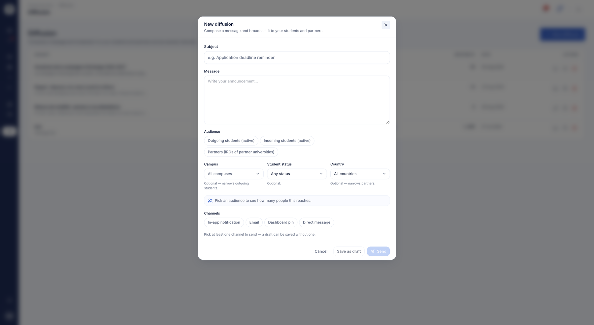

# Communications & notifications

Ce module regroupe tout ce qui touche à la communication du bureau des relations
internationales : diffuser un message à une audience ciblée, notifier en temps
réel, échanger en direct avec un étudiant ou un partenaire, et relancer
automatiquement les documents manquants. L'objectif : remplacer les envois manuels
dispersés par des outils intégrés et suivis.

## Diffusion de messages

**À quoi ça sert.** Vous rédigez un message une seule fois et le diffusez sur
plusieurs canaux — notification dans l'application, e-mail, épinglage au tableau de
bord, message direct — vers des audiences ciblées. Fini le publipostage manuel :
vous ciblez, vous envoyez, et vous gardez une trace.

**Pour qui.** coordinateur / gestionnaire RI

**Comment ça marche.** Le compositeur vous laisse choisir les audiences (étudiants
sortants, étudiants entrants, partenaires) et des filtres optionnels (pays, campus,
statut d'accès de l'étudiant), avec un compteur de destinataires en direct avant
l'envoi. Vous pouvez aussi partir d'une **sélection explicite** : cochez les
étudiants voulus dans votre liste, ou les contacts voulus dans votre annuaire, et
lancez la diffusion sur eux seuls — utile quand le groupe visé ne se décrit par
aucun filtre. Vous sélectionnez les canaux souhaités, vous pouvez enregistrer un
brouillon, et un message envoyé est verrouillé. À l'envoi, un récapitulatif indique
le nombre de destinataires, d'e-mails partis et de messages épinglés. Un message
épinglé peut ensuite être retiré du tableau de bord.

*La composition d'une diffusion : le sujet, le message, l'audience visée, les filtres facultatifs et les canaux d'envoi.*

**Cas d'usage.**
> Un coordinateur envoie « Date limite de nomination reportée au 15 mars » à tous
> les étudiants sortants en Espagne, épinglé sur leur tableau de bord et envoyé
> par e-mail.

## Notifications dans l'application

**À quoi ça sert.** Chaque utilisateur dispose d'un fil de notifications avec un
compteur de non-lus en direct dans la barre supérieure. Coordinateurs, partenaires
et étudiants restent informés des nouveaux messages et événements sans dépendre de
l'e-mail.

**Pour qui.** coordinateur / partenaire / étudiant

**Comment ça marche.** La cloche affiche le nombre de notifications non lues ;
ouvrir une notification la marque comme lue, et un bouton permet de tout marquer
lu d'un coup. Une notification peut renvoyer vers le message d'origine.

**Cas d'usage.**
> Un étudiant voit un « 3 » sur la cloche, l'ouvre et découvre que son Learning
> Agreement vient d'être approuvé.

## Messagerie directe

**À quoi ça sert.** Une messagerie privée en fil de discussion entre les trois
types d'acteurs — équipe RI, étudiants, équipe AroundLink. Les questions se
règlent dans la plateforme plutôt que par e-mails éparpillés.

**Pour qui.** coordinateur / étudiant / partenaire

**Comment ça marche.** Chaque profil a sa propre boîte de réception : liste des
conversations, fil un-à-un avec lecture à l'ouverture, réponse, et un sélecteur
« nouveau message » pour démarrer un échange. Un compteur de non-lus s'affiche dans
la barre supérieure.

**Cas d'usage.**
> Un étudiant entrant écrit au bureau d'accueil pour poser une question sur le
> logement ; le coordinateur répond dans le fil.

## Campagnes de relance de documents

**À quoi ça sert.** Des campagnes d'e-mails de relance automatisées et suivies
poussent les étudiants à déposer leurs documents manquants, avec des statistiques
d'ouverture, de clic et de rejet par campagne. La chasse aux documents devient une
opération mesurable en un clic.

**Pour qui.** coordinateur / gestionnaire RI

**Comment ça marche.** Une campagne cible les étudiants par type de document,
niveau d'études et campagnes associées. La liste des campagnes et une fenêtre de
statistiques affichent le nombre d'envois, le taux d'ouverture, le taux de clic et
le taux de délivrabilité. Les e-mails partent ensuite automatiquement en tâche de
fond.

**Cas d'usage.**
> Un coordinateur lance une relance pour tous les étudiants de Master à qui il
> manque le Learning Agreement, puis vérifie un taux d'ouverture de 62 % dans la
> fenêtre de statistiques.

!!! tip "Depuis les campagnes"
    Les relances se déclenchent aussi depuis le suivi des documents d'une
    [campagne](../etablissement/campagnes.md) : c'est la même mécanique de relance
    documentée ici.

## Relances de demande d'avis

**À quoi ça sert.** Solliciter les étudiants qui n'ont pas encore déposé d'avis sur
leur établissement d'accueil, sur le même principe que les relances de documents.

**Pour qui.** coordinateur / gestionnaire RI

**Comment ça marche.** Vous ciblez votre audience par niveau d'études et par
campagne, ou vous désignez directement les étudiants concernés — nommer des
étudiants prend alors le pas sur les filtres. Un aperçu vous indique combien de
personnes seront touchées avant l'envoi, et ce nombre correspond exactement à qui
recevra le message.

Les étudiants ayant déjà répondu sortent d'eux-mêmes de la relance : inutile de
tenir une liste à la main.

**Cas d'usage.**
> En fin de semestre, le coordinateur relance les étudiants de Master rentrés de
> mobilité qui n'ont pas encore laissé d'avis ; l'aperçu annonce 12 destinataires,
> et 12 messages partent.
