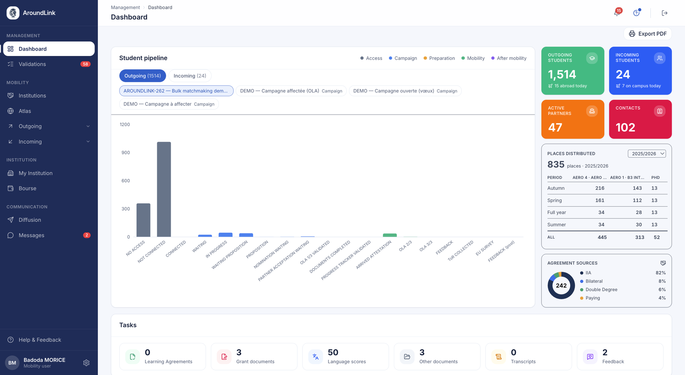

# Dashboard

The dashboard is your team's home page: **what needs acting on today**, and where your
mobility stands as a whole.

## Your student pipeline

**What it's for.** Seeing where your students sit along their path, and spotting where it
gets stuck.

**Who it's for.** IRO manager / coordinator

**How it works.** A nineteen-bar histogram, spread over the **five stages of a mobility** —
access, campaign, preparation, mobility, after — each with its own colour.

You switch between your **outgoing** and **incoming** students, then pick the view: each
button on the second row is a campaign, and the histogram shows only its students.

!!! warning "The bars do not add up — and that is deliberate"
    The first nine, those of access and campaign, are **mutually exclusive**: a student is
    either "no access" or "connected", never both.

    From preparation onwards they are **checklist items**: one student in mobility can raise
    five bars at once — agreement validated, documents complete, arrival certificate. That is
    why no total is shown: it would mean nothing.

**Use case.**
> The coordinator switches to her spring campaign and sees "awaiting proposal" climb to
> forty-eight while "proposal" stays at zero. The matching round has not been run yet.

*A coordinator's dashboard: the pipeline and its five colours, the four counters for today, places distributed by period and track, where the agreements come from, and at the bottom the tiles of what awaits validation.*

## Today's figures

**How it works.** Four counters at the top of the page: your **outgoing students**, with how
many are abroad today; your **incoming** ones, with those on campus; your **active
partners**; your **contacts**.

These are figures for right now, not year totals.

## Places distributed

**How it works.** A cross-table: your **periods** as rows — autumn, spring, full year, summer
— and your **tracks** as columns, with the total for the chosen school year at the top. You
change year from a menu.

It is the overview of what you have opened, before going into one agreement's matrix.

## Where your agreements come from

**How it works.** A ring splits your agreements by family — Erasmus+, bilateral, double
degree, paying mobility — with each one's share.

**Use case.**
> The manager sees that 56% of their agreements are Erasmus+ and 7% paying mobility, and
> decides to balance the network next year.

## What is waiting on you

**What it's for.** Starting your day with what is blocking somebody else.

**How it works.** A row of tiles mirrors the **validation queue's own buckets**: learning
agreements, nominations, transcripts, language scores, feedback, grant documents, other
documents.

Each tile opens the queue **already filtered on its bucket**. Clicking a precise number only
to land on an unfiltered three-hundred-row list would be a click you then have to undo.

!!! note "Three families of documents, not one"
    Documents are split the way the queue splits them: a grant certificate blocking a payment
    is not a CV. Grouping them would bury the urgent one in the pile.

**Use case.**
> Monday morning, the "learning agreements" tile reads twelve. One click, and the queue opens
> on those twelve, ready to validate.

## Steering indicators

**What it's for.** The underlying trends, for decisions from one year to the next rather than
for this week.

**Who it's for.** international office management

**How it works.** Below the operational blocks, a set of steering indicators: mobility
growth, the most requested destinations, place occupancy, inclusion and fewer-opportunities
groups.

They are read-only and cover your institution alone.
