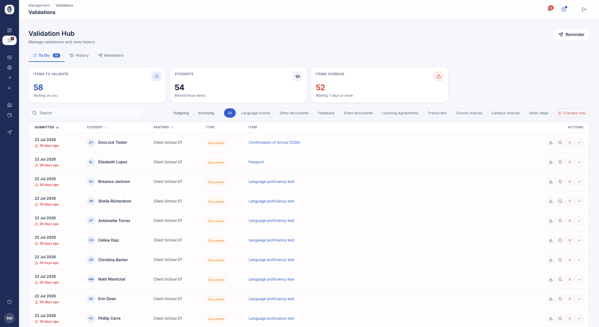
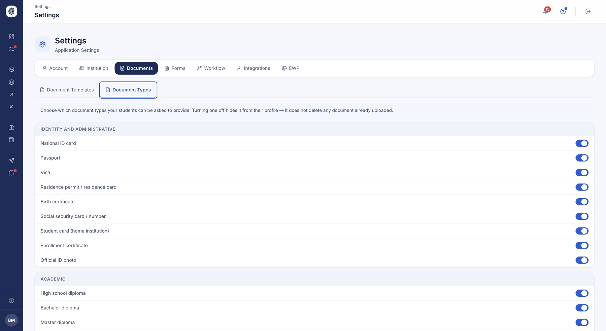
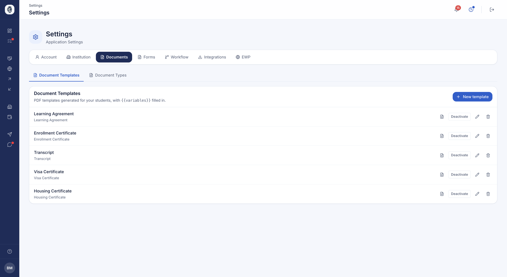

# Documents & validation

The Documents module brings together, in one place, everything your international
relations office needs to produce, review and validate during a mobility: the learning
agreement (Learning Agreement / OLA), the transcript of records, students' administrative
files and official document templates. The goal: a clear flow, a single queue for
validations, and Erasmus+ rules applied automatically.

## Learning Agreement (OLA)

**What it does.** The Learning Agreement describes the programme of courses a student
will follow abroad. This view lets the office track every agreement, see at a glance
which ones are pending, validated or need corrections, and enforce the signature of both
institutions before an agreement becomes final.

**Who it's for.** RI manager / coordinator

**How it works.** The coordinator opens the OLA list, filters by status and reviews each
agreement in a window that shows its history. They can request modifications — the
agreement then returns to draft with a comment for the student — or approve it. For a
standard agreement, each institution signs on its own side, in any order, and the
agreement is validated only once both signatures are in place; for an EWP agreement,
approval hands the agreement to the host institution following the network's sequential
flow.

*Everything waiting on your decision, with the number of overdue items and filters by document type.*

*The documents your institution asks for, by family. Turning a type off removes it from the student's profile without deleting anything already uploaded.*

*Your generated document templates — acceptance letter, enrolment certificate, learning agreement, transcript — where the student's details replace the variables.*

**Use case.**
> The coordinator reviews Marie's pre-departure OLA (3 courses, 18 ECTS), asks her to
> swap one course, then signs on behalf of the sending institution; as soon as the
> partner signs in turn, the OLA becomes "Validated".

## PDF generation: OLA & transcript of records

**What it does.** Produces the official PDF of the learning agreement or the transcript
of records from the institution's document template (letterhead, layout), with the
student's course table inserted automatically. The office gets a document ready to file,
in the institution's colours.

**Who it's for.** RI manager / coordinator

**How it works.** From the OLA list, the coordinator downloads the PDF of the learning
agreement or the transcript of records. The agreement can only be downloaded once fully
validated; the transcript once the transcript itself is validated. The system fills the
template with the courses (and the grades, for the transcript).

**Use case.**
> After both signatures, the coordinator downloads the Learning Agreement as a PDF, on
> the institution's letterhead, for the student's file.

## Transcript of Records (ToR)

**What it does.** Manages the incoming student's transcript that the host institution
must return to the home institution. The coordinator reviews the entered grades and the
uploaded official transcript, then validates or requests corrections.

**Who it's for.** RI manager / coordinator (validation) ; student (entry)

**How it works.** The student enters each grade according to the chosen grading system
and uploads the official transcript. The coordinator opens the transcript in a window
showing the history and the uploaded document, then validates — the transcript becomes
downloadable — or sends the file back to the student for correction.

**Use case.**
> An incoming student uploads their official transcript and enters their grades; the
> coordinator checks, validates, and the transcript of records is ready to be sent to
> the home university.

## Validation Hub

**What it does.** A single queue where the coordinator validates everything the student
submits during their mobility — administrative files, learning agreements, transcripts
and testimonials about partners — without having to browse several screens. Items that
have been waiting a long time are flagged as urgent, and every decision is archived with
its author, its outcome and the refusal reason.

**Who it's for.** RI manager / coordinator

**How it works.** The queue gathers pending documents, OLAs awaiting the institution's
signature, transcripts and testimonials, with counters (pending / students concerned /
urgent). The coordinator opens each item and decides to validate or refuse; a comment is
required when refusing. A "History" tab lists past decisions with their reason.

**Use case.**
> Monday morning, the coordinator sees 12 pending items, 3 of them urgent: they validate
> two passports, sign one OLA on behalf of the sending institution, and refuse an
> unreadable insurance certificate with a comment — all from the same queue.

## Students' administrative files

**What it does.** A central page listing all files uploaded by students (passport,
insurance, language tests, arrival/departure certificates, etc.) with their status. The
office validates or refuses files one by one or in bulk, records arrival dates and
launches reminder campaigns to students whose documents are missing or were refused.

**Who it's for.** RI manager / coordinator

**How it works.** The coordinator filters the file list, validates or refuses several at
once, enters a student's arrival date, estimates how many students would be reminded,
then triggers a reminder campaign in one click.

**Use case.**
> The coordinator filters on "Refused", selects 8 files, refuses them in bulk with a
> comment, then sends a reminder to the students concerned.

## Document templates

**What it does.** Lets each institution design its own reusable document templates
(nomination letter, learning agreement, acceptance letter, enrolment certificate,
transcript of records, visa certificate, housing certificate) with `{{…}}` fields that
fill automatically with a student's real data.

**Who it's for.** RI manager / coordinator

**How it works.** The coordinator lists, creates and edits their templates, composes the
document body using the available variables, previews the layout as a PDF (tokens still
visible) to check spacing and pagination, then generates a filled PDF for a given
student. They can activate/deactivate a template or delete it. Institutional templates
made available are visible read-only.

**Use case.**
> The coordinator creates an "Acceptance Letter" template with the institution's logo,
> checks the preview, then generates it filled for an incoming student in one click.

## Enable / disable document types

**What it does.** Lets each institution enable or disable certain document types, so an
unwanted type stops appearing on the students' upload page and in dropdown lists. By
default, all types are active.

**Who it's for.** RI manager / coordinator

**How it works.** In Settings → Documents, each document type has an ON/OFF switch saved
per institution.

**Use case.**
> An institution that never issues housing certificates disables that type: it
> disappears from every student's checklist.

## Agreement update review (IIA)

**What it does.** When a partner institution pushes changes to an inter-institutional
agreement (IIA) over the EWP network, this review shows a field-by-field comparison and
lets you selectively accept or reject the changes before they touch local data.

**Who it's for.** RI manager / coordinator

**How it works.** The coordinator opens the pending update and sees the comparison
between their version and the partner's. They tick the fields to accept and apply — a
count of applied/skipped fields is shown — or reject the update, in which case their data
stays unchanged.

**Use case.**
> The partner changes the agreement's ECTS and languages; the coordinator accepts the
> language change but rejects the ECTS one — only the accepted field is written locally.

