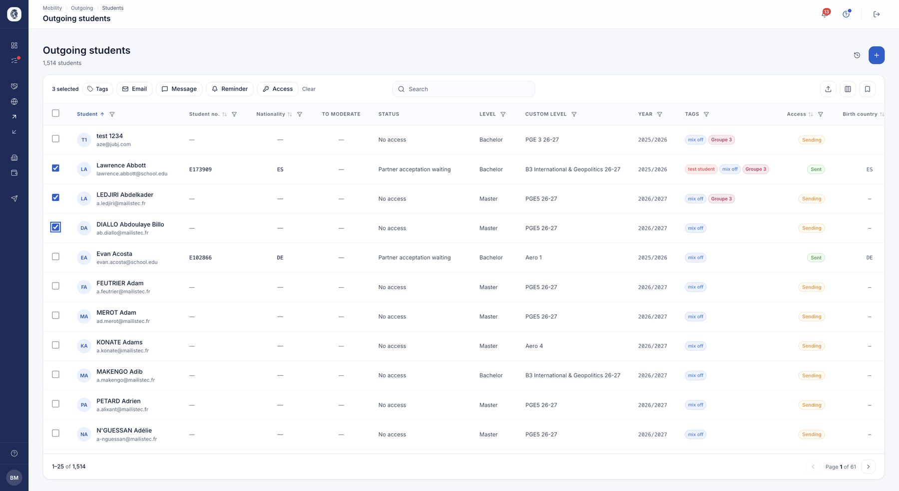
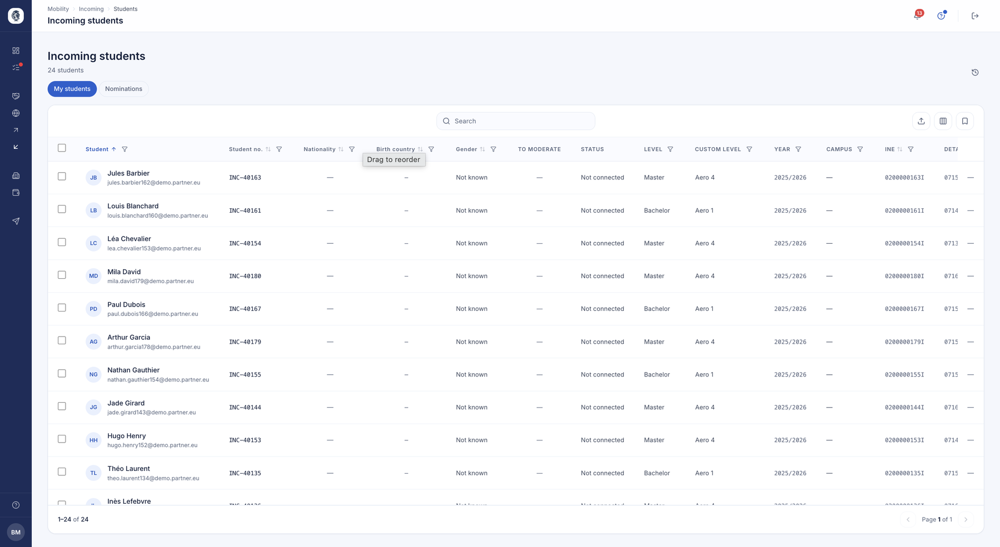
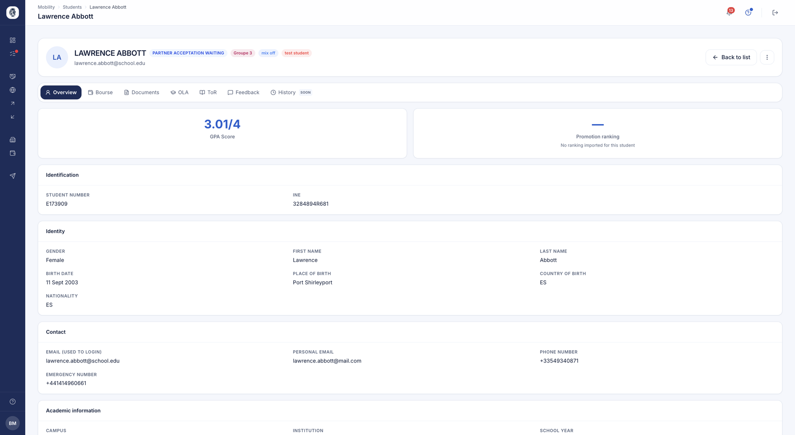
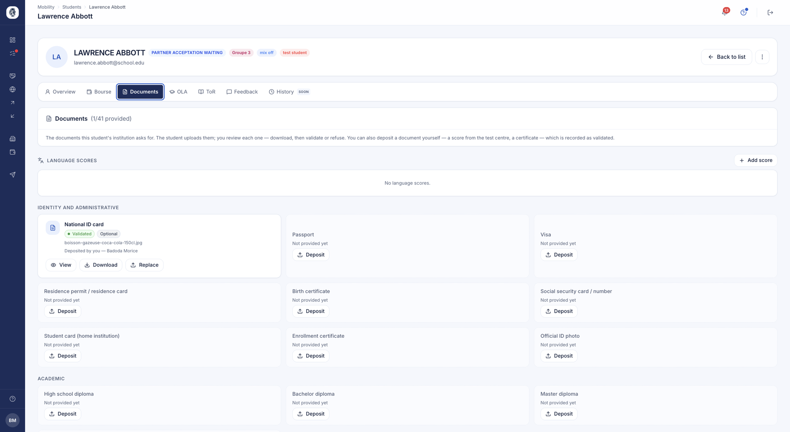

# Étudiants

Toute la population étudiante que votre bureau suit se gère depuis deux listes —
ceux que vous envoyez, ceux que vous accueillez — et une fiche par étudiant qui
rassemble son dossier complet.

## Étudiants sortants

**À quoi ça sert.** Retrouver la totalité des étudiants de votre établissement qui
partent en mobilité, suivre où en est chacun, et agir sur plusieurs d'entre eux à
la fois.

**Pour qui.** gestionnaire RI / coordinateur

**Comment ça marche.** Chaque ligne est un étudiant. La liste se trie et se filtre
sur toutes ses colonnes — niveau, campus, année, campagnes, tags, statut d'accès.
La colonne *Accès* indique où en est l'ouverture de son compte : jamais envoyé, en
cours d'envoi, ou connecté.

En sélectionnant plusieurs étudiants, vous leur ouvrez les accès, posez ou retirez
des tags, envoyez un e-mail, un message interne ou une relance — en une seule
opération. La liste s'importe et s'exporte depuis un tableur.

*Vos étudiants sortants. La barre du haut apparaît dès qu'une sélection est faite et regroupe les actions applicables à tout le lot. Cliquez sur l'image pour l'agrandir.*

**Cas d'usage.**
> Le coordinateur filtre sur la promotion Master, sélectionne les 40 étudiants
> concernés et leur ouvre l'accès à la plateforme en une fois.

!!! note "Nommer un étudiant"
    La nomination chez un partenaire ne part pas de cette liste : elle intervient
    depuis la [campagne](campagnes.md), une fois l'étudiant affecté à une
    destination.

## Étudiants entrants

**À quoi ça sert.** Suivre les étudiants que vos partenaires vous envoient, depuis
la nomination jusqu'à la fin de leur séjour.

**Pour qui.** gestionnaire RI / coordinateur

**Comment ça marche.** Deux onglets séparent ce qui vous est proposé de ce que vous
avez accepté : *Nominations* pour les propositions en attente de votre décision,
*Mes étudiants* pour ceux que vous accueillez effectivement. Un étudiant entrant
apparaît dès la nomination, avant même d'avoir un compte.

Une fois la nomination acceptée, vous lui ouvrez son accès : il reçoit ses
identifiants et peut compléter son dossier. La liste se trie, se filtre et se
tague exactement comme celle des sortants.

*Vos étudiants entrants, avec leur niveau, leur année et l'état de leur connexion à la plateforme.*

**Cas d'usage.**
> Une université partenaire nomine douze étudiants ; le coordinateur en accepte
> onze, en refuse un, puis ouvre les accès aux onze retenus.

## La fiche d'un étudiant

**À quoi ça sert.** Réunir en un seul endroit tout ce qui concerne un étudiant :
son identité, son dossier documentaire, son contrat pédagogique, son relevé de
notes, sa bourse et ses avis.

**Pour qui.** gestionnaire RI / coordinateur

**Comment ça marche.** Cliquez sur une ligne pour ouvrir la fiche. Des onglets
séparent les grands volets du dossier. L'onglet *Vue d'ensemble* rassemble son
identité, ses coordonnées, ses informations académiques, sa moyenne et son
classement de promotion lorsqu'ils ont été importés.

*La vue d'ensemble d'un étudiant : identification, identité, contacts et informations académiques.*

**Cas d'usage.**
> Avant de valider une nomination, le coordinateur ouvre la fiche pour vérifier le
> niveau de langue et la moyenne de l'étudiant.

## Les documents d'un étudiant

**À quoi ça sert.** Voir d'un coup d'œil ce que l'étudiant a fourni, ce qu'il lui
reste à déposer, et agir sur chaque pièce.

**Pour qui.** gestionnaire RI / coordinateur

**Comment ça marche.** L'onglet *Documents* liste toutes les pièces que votre
établissement demande, regroupées par famille — identité et administratif,
académique, financier. Chaque carte indique si la pièce est fournie, validée ou
encore attendue, et si elle est obligatoire ou facultative.

L'étudiant dépose lui-même ses documents ; vous les consultez, les téléchargez,
puis les validez ou les refusez. Vous pouvez aussi déposer une pièce à sa place —
un score reçu directement du centre d'examen, par exemple — auquel cas elle est
enregistrée comme validée, et la fiche garde la trace de qui l'a déposée.

*Les documents d'un étudiant, par famille, avec leur état et les scores de langue enregistrés.*

**Cas d'usage.**
> Le coordinateur reçoit par courrier le certificat de langue d'une étudiante, le
> dépose lui-même sur sa fiche, et la pièce apparaît aussitôt comme validée.

!!! note "Valider en série"
    Pour traiter d'un coup tout ce que vos étudiants ont soumis, passez par les
    [validations](documents.md) plutôt que fiche par fiche.
