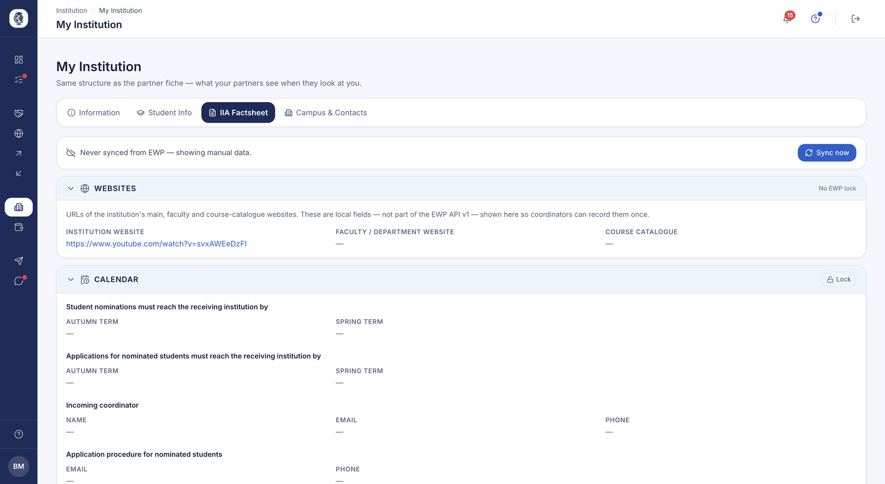
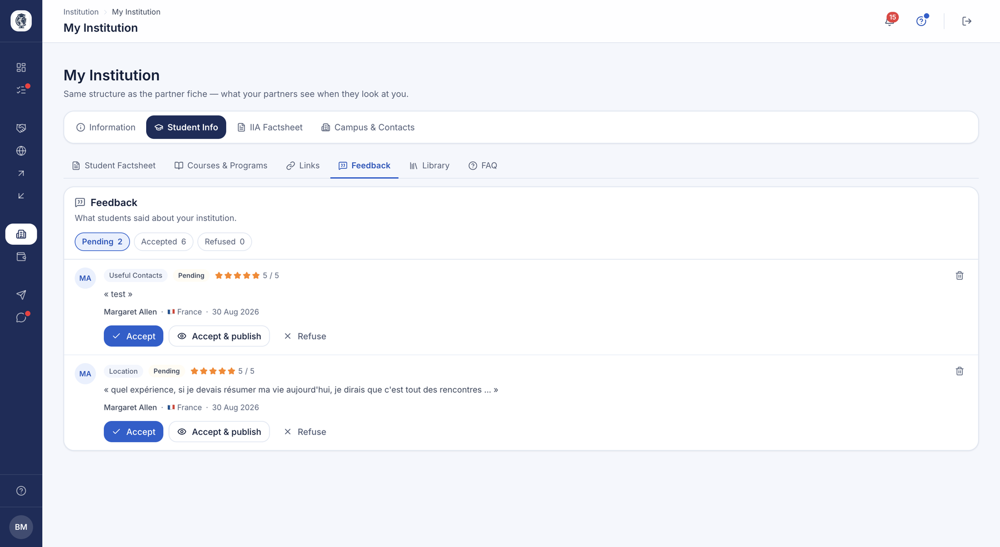
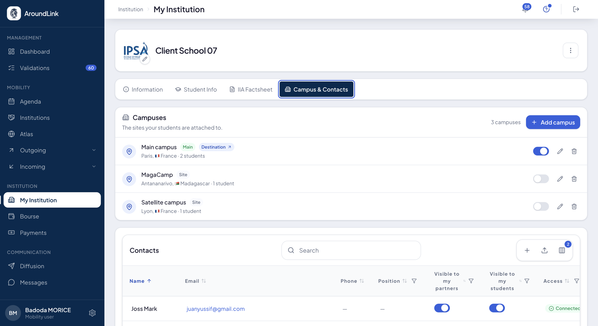

# My institution (Resource Hub)

"My institution" is the space where the International Relations Office keeps up to
date all the practical information its outgoing and incoming students will see:
identity, factsheet, courses, useful links, a document library and FAQs. Here you
see your institution exactly as your partners see it, and you moderate the published
student reviews.

## "My institution" content editor

**What it's for.** This is the single place to keep the student-facing knowledge
base current. You manage the institution's identity and all its practical content,
with visibility adjustable per audience (incoming, outgoing, free mobility). One
place to keep the information students see accurate and up to date.

**Who it's for.** coordinator / IR manager

**How it works.** The page is organized into three tabs. **Information**: identity
fields (code, name, country…), the logo and accreditations. **Student info**: a
container of six sub-tabs — factsheet, courses, links, feedback, library and FAQ —
where each item carries its visibility audiences. **IIA factsheet**: your own EWP
factsheet (sync, calendar, coordinators…). Content is authored as blocks attached to
categories and sub-categories.

*Your factsheet as your partners read it: websites, nomination and application deadlines per term, incoming coordinators and the procedure to follow. The banner at the top says whether the data came from an EWP sync or from your own entry, and the padlock locks a section so a sync cannot overwrite it.*

**Use case.**
> A coordinator adds a "Cost of living in Lisbon" link visible only to incoming
> students, then uploads a welcome PDF to the library.

!!! note "Student side"
    The documents and resources you make visible appear in the "Resources" area of
    the student portal — see the student-portal documentation.

### Factsheet, courses, links, library and FAQ

**What it's for.** These sub-tabs make up the practical content a student consults
before and during mobility: institution overview, course offer, external links,
downloadable documents and frequently asked questions.

**How it works.** Each sub-tab offers full management (add, edit, delete) of its
items, with per-audience visibility settings. The library accepts downloadable
files; the FAQ is authored as question-and-answer pairs.

### IIA factsheet (EWP)

**What it's for.** The "IIA factsheet" tab shows your own institution's EWP
factsheet — the one the network and your partners consult: nomination calendar,
coordinators, contact information. You keep it synchronized from this screen.

**How it works.** The tab displays your EWP factsheet and its associated information
(sync, calendar, coordinators). It's the "our side" counterpart of the factsheet you
consult at a partner.

## Student-review moderation

**What it's for.** You collect reviews from students returning from mobility
(rating, topic, free text, photos) and moderate them before they appear to future
students. It's a trusted, first-hand review layer to help with destination choice.

**Who it's for.** coordinator / IR manager

**How it works.** A review carries a rating, a topic, the author's name, the country
type, content and optional photos. From the "feedback" sub-tab, you accept or refuse
each contribution; accepted, public reviews then surface to students.

*The reviews left about your institution, split between pending, accepted and refused. Each carries its topic, rating and author, and you choose to accept it internally, accept and publish it, or refuse it.*

**Use case.**
> A student back from Antalya leaves a 4-star review with photos; the coordinator
> approves it, and it shows on the Antalya page for next year's applicants.

## Opening a campus as a destination

**What it's for.** Offering one of your own campuses as a mobility destination — to your
other campuses, or to your partners.

**Who it's for.** admin

**How it works.** A switch, in the campus list you already maintain. You turn it on, and the
campus becomes a destination.

Its record is created **from what you have already entered** — name, address, domain. There
is no double entry, and nothing more to fill in to get started.

Your campuses can then **exchange students with each other**. A student from the Lyon campus
sees the Toulouse one like any other destination — but not their own: their campus stays
visible without being selectable.

Turning the switch off removes the campus from destinations. You can turn it back on: the
record is kept, not rebuilt.

*Your campuses, each with its switch. The one turned on carries the "Destination" badge: it has become a destination like any other.*

**Use case.**
> The school has three campuses. It opens all three, and its first-year students can spend a
> semester on another campus without leaving the same campaign process they would use for an
> international mobility.
