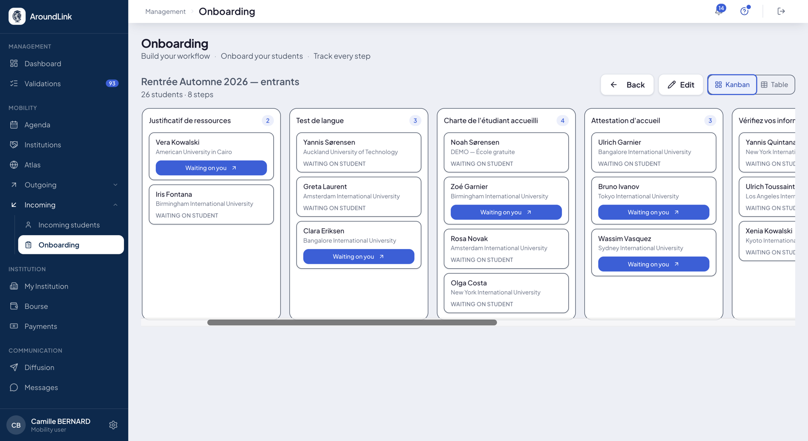
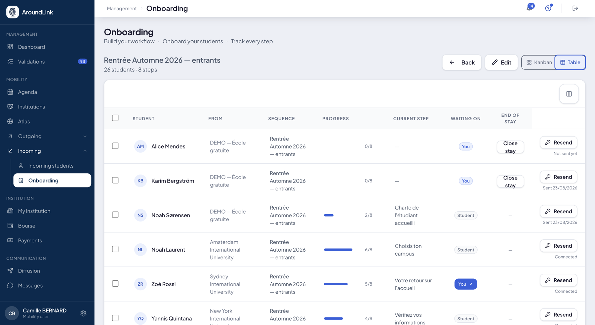
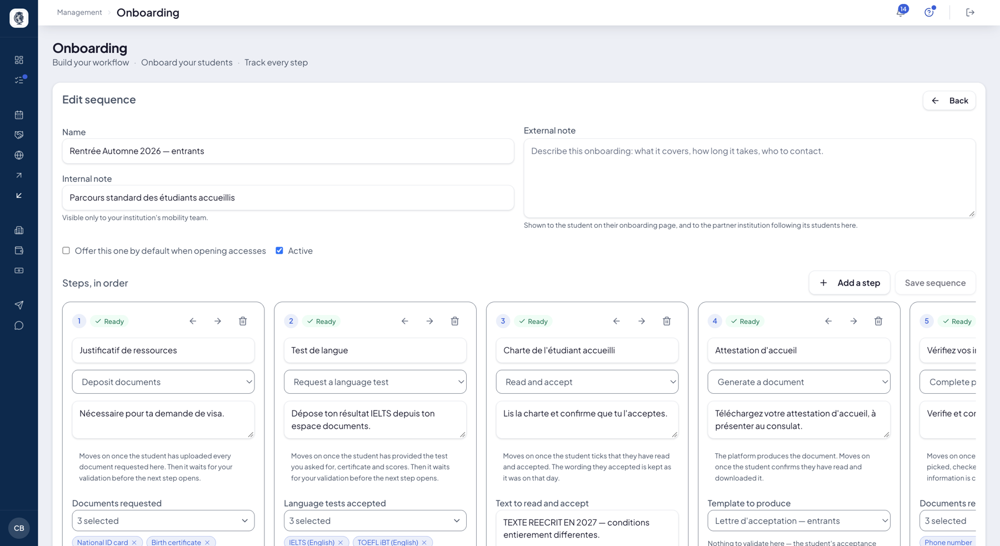
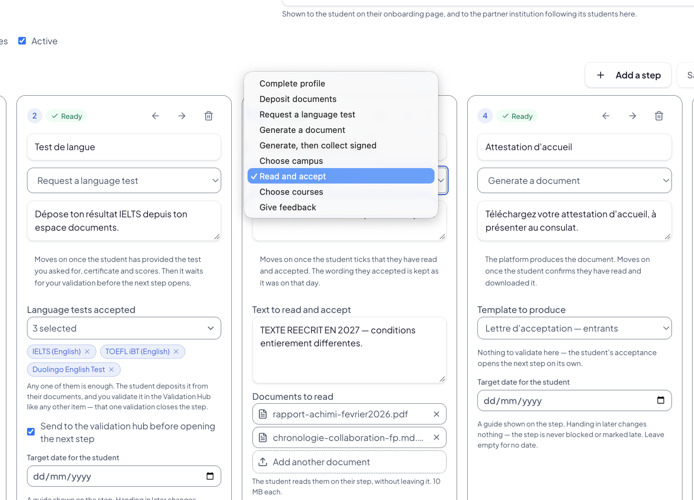

# Onboarding des entrants

L'onboarding est le **parcours que suit un étudiant que vous accueillez**, de son premier
accès jusqu'à la fin de son séjour : compléter son profil, déposer ses pièces, choisir son
campus, lire et accepter une charte, recevoir son attestation.

Vous définissez ce parcours une fois — c'est une **séquence** — et tous les étudiants
concernés le suivent, étape après étape.

## Suivre où en est chacun

**À quoi ça sert.** Savoir, d'un coup d'œil, qui attend quoi : vos étudiants qui n'ont pas
encore agi, et ceux qui attendent une décision de votre part.

**Pour qui.** gestionnaire RI / coordinateur

**Comment ça marche.** Deux vues du même parcours.

La **vue Kanban** montre une colonne par étape et une carte par étudiant. Chaque carte porte
son établissement d'origine et dit qui doit agir : *en attente de l'étudiant*, ou un bouton
bleu **« Waiting on you »** quand la balle est dans votre camp.

*Une colonne par étape, une carte par étudiant. Le compteur en tête de colonne dit combien s'y trouvent, et le bouton bleu signale ce qui vous attend.*

La **vue tableau** donne la même chose en lignes, avec l'avancement chiffré — 2/8, 6/8 — son
étape courante, qui doit agir, et l'état de son accès : pas encore envoyé, envoyé à telle
date, ou déjà connecté. Vous relancez d'un bouton, et vous clôturez le séjour quand il
s'achève.

*La même cohorte en tableau : l'avancement sur huit étapes, l'étape en cours, qui est attendu, et l'état de l'accès de chacun.*

## Construire une séquence

**À quoi ça sert.** Décrire votre parcours d'accueil une fois pour toutes, dans l'ordre où
vous voulez qu'il se déroule.

**Pour qui.** gestionnaire RI / coordinateur

**Comment ça marche.** Une séquence porte un nom, et deux notes qu'il ne faut pas confondre :

- la **note interne** n'est vue que par votre équipe ;
- la **note externe** est montrée à l'étudiant sur sa page d'onboarding, **et à
  l'établissement partenaire** qui suit ses étudiants chez vous.

Deux cases décident de son usage : **Active**, et **proposer celle-ci par défaut à
l'ouverture des accès** — pratique quand vous n'en avez qu'une.

Les étapes se déclarent ensuite dans l'ordre, et se réorganisent à la flèche.

*Le nom, les deux notes, les interrupteurs, puis les étapes dans leur ordre — chacune avec son type, sa consigne à l'étudiant et ses réglages.*

## Ce qu'une étape peut demander

**Comment ça marche.** Le catalogue est **fermé**, et c'est voulu : chaque type d'étape
branche une fonction qui existe déjà dans l'outil — un type de document, un modèle, le
catalogue de cours. Une étape n'est donc jamais un champ de texte libre : le parcours
**ordonne des fonctions existantes** et les rend obligatoires au bon moment.

*Les neuf types disponibles. Sous chaque étape, la phrase grise rappelle ce qui la fait avancer.*

| Type d'étape | Ce qu'elle demande | Ce qui la fait avancer |
|---|---|---|
| **Compléter son profil** | Les informations que vous désignez | L'étudiant les a toutes renseignées |
| **Déposer des documents** | Les types de pièces que vous choisissez | Tout est déposé — puis votre validation |
| **Fournir un test de langue** | Un test parmi ceux que vous acceptez | Le certificat **et** les scores sont fournis — puis votre validation |
| **Produire un document** | Rien de l'étudiant | La plateforme produit le document ; l'étudiant confirme l'avoir lu et téléchargé |
| **Produire, puis récupérer signé** | Le document signé en retour | Le dépôt du document signé |
| **Choisir son campus** | Un campus parmi les vôtres | Le choix est fait |
| **Lire et accepter** | La lecture d'un texte et de pièces jointes | L'étudiant coche avoir lu et accepté |
| **Choisir ses cours** | Une sélection dans votre catalogue | La sélection est faite |
| **Donner son avis** | Un retour d'expérience | L'avis est déposé |

!!! note "Un test de langue n'est pas un document comme un autre"
    Vous listez les tests acceptés — IELTS, TOEFL iBT, Duolingo — et **l'un d'eux suffit**.
    Ce qui est attendu n'est pas seulement un PDF scanné, mais le résultat structuré : type
    de test, score global, les quatre compétences, le niveau européen. C'est ce qui vous
    permet de décider.

!!! tip "La date cible ne bloque rien"
    Chaque étape peut porter une date indicative. Elle guide l'étudiant, rien de plus :
    rendre après ne bloque pas l'étape et ne la marque pas en retard. Laissez-la vide si
    vous n'en voulez pas.

!!! warning "Validation : qui ouvre l'étape suivante"
    Sur un dépôt de documents ou un test de langue, vous pouvez demander que le dossier
    passe par la **file de validation** avant que l'étape suivante s'ouvre. Sans cette case,
    l'action de l'étudiant suffit à faire avancer le parcours.

    Sur une lecture de charte ou un document produit, il n'y a rien à valider : l'acceptation
    de l'étudiant ouvre la suite d'elle-même. Et le texte qu'il a accepté est conservé **tel
    qu'il était ce jour-là**, même si vous le modifiez ensuite.

**Cas d'usage.**
> L'école accueille vingt-six entrants. Elle construit une séquence en huit étapes :
> justificatif de ressources, test de langue, charte à accepter, attestation d'accueil à
> télécharger, choix du campus, puis les cours. Chaque étudiant avance à son rythme ; la vue
> Kanban montre à la coordinatrice les trois dossiers qui attendent sa validation, et le
> reste se fait sans elle.
