# Settings & team

**Settings** bring together your institution's administrative configuration: its
structure (campuses, organizational units, academic levels), team and permissions
management, the user directory, personalised working views, and the connection to
external systems. It is the control centre of the international relations office.

## Campuses

**What it's for.** Declare your institution's campuses (name, city, country, one
main campus), to attach students to a campus and reflect your real structure.

**Who it's for.** RI manager / admin

**How it works.** A management screen (Settings ▸ Institution) lists the campuses
with the number of students attached to each. Deletion is blocked while students
are still attached, to prevent any loss of link.

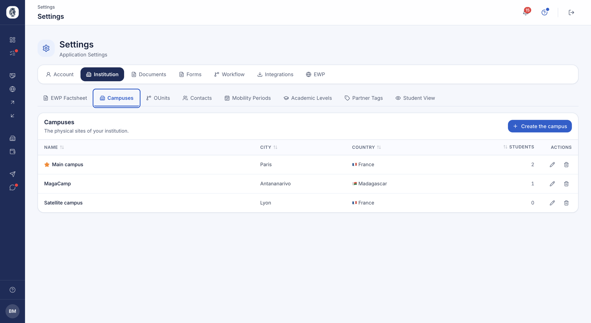

*Your physical sites, with the number of students attached to each.*

**Use case.**
> A multi-site school declares its Paris and Lyon campuses, then assigns students
> to each.

??? note "Internal details (AroundLink team)"
    `CampusesController`. `Campus` entity (university, name, city, country, main
    flag). Deletion checks the number of attached students. Ownership is checked on
    edit and delete.

## Organizational units (OUnits)

**What it's for.** Maintain your institution's EWP organizational units (faculties,
departments), so Erasmus (EWP) data exchange references the correct
sub-structures.

**Who it's for.** RI manager / admin

**How it works.** A management screen lists the units, each with a name, an
optional description and an identifier. It works like the campuses screen.

**Use case.**
> The office declares the "Faculty of Engineering" as a unit with its EWP
> identifier.

??? note "Internal details (AroundLink team)"
    `OunitsController`. `Ounit` entity (university, name, description, unit
    identifier). Screen modelled on the campuses one.

## Custom academic levels

**What it's for.** Name your academic levels with your own vocabulary (for example
"Aéro 4", "M1 Ingé") while keeping a standard mapping (EQF) behind the scenes — so
dropdowns are familiar to your team and EWP exchange stays standards-compliant.

**Who it's for.** RI manager / admin

**How it works.** A management screen (Settings ▸ Institution) lets you create,
edit and delete your level labels, each mapped to an EQF level. Each row shows how
many places or agreements use that level. Duplicate labels are rejected.

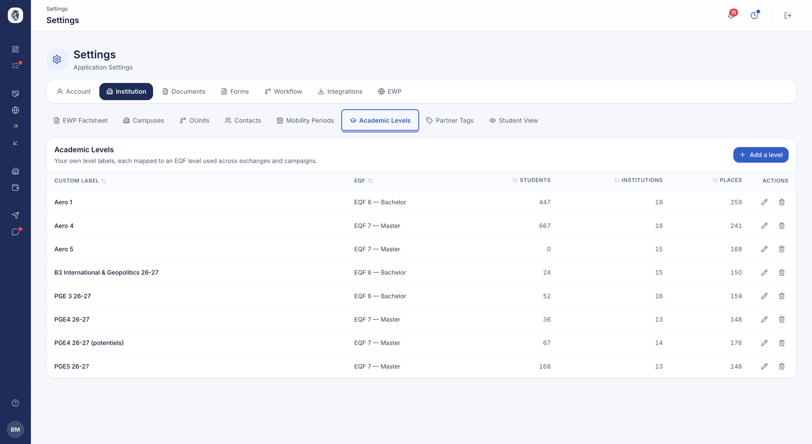

*Your own level labels, each mapped to a European level, with how many students, institutions and places depend on them.*

**Use case.**
> An engineering school defines "Aéro 4" mapped to EQF 7, to filter campaigns and
> agreements by its real level names.

??? note "Internal details (AroundLink team)"
    `AcademicLevelSettingsController`. `AcademicLevelCustom` entity (university,
    label unique per institution, EQF level). Consuming entities store the standard
    EQF value, not the label, to preserve EWP/OLA export compatibility.

## Key to connect external systems

**What it's for.** Give your institution a key to connect AroundLink to your
external systems (data exchange, integrations), with the ability to renew it when
needed.

**Who it's for.** admin

**How it works.** A page shows your connection key and offers a "Regenerate" action
that replaces the existing key with a new one. Keep this key confidential: share it
only with the people configuring your integrations.

**Use case.**
> After a change in the technical team, the admin regenerates the key to revoke the
> old one.

!!! warning "Confidentiality"
    A connection key is a sensitive credential. Never share it publicly, and
    regenerate it if you believe it may have been exposed.

??? note "Internal details (AroundLink team)"
    `ApiKeyController`. The key is created on first visit and renewable in one
    click. Attached to the user's account.

## Protected deletions

**What it's for.** Stop you from deleting a setting still in use somewhere, and
tell you exactly where it is used.

**Who it's for.** RI manager / coordinator

**How it works.** Your campuses, periods, study levels, document types and tags
each show a usage counter. As long as it is not at zero, deletion is refused and
the detail tells you what depends on it — an agreement, a campaign, a student
file.

You remain free to rename an item at any time: the change carries everywhere it
appears, breaking nothing.

**Use case.**
> The coordinator wants to delete a period that is no longer needed; the counter
> shows it is still used by three agreements, which they adjust before retrying.

## Tags

**What it's for.** Create your own labels to organise your students and partner
institutions by your own criteria — a cohort, a programme, a group of
destinations, a point to watch.

**Who it's for.** RI manager / coordinator

**How it works.** Each tag carries a name and a colour, and applies to one of
three scopes:

- **General** — offered on both students and partners
- **Student** — offered on students only
- **Institution** — offered on partners only, and usable as a campaign filter

Once your tags exist, you apply them from the student or partner lists. Select
several rows to add or remove tags across the whole selection at once.

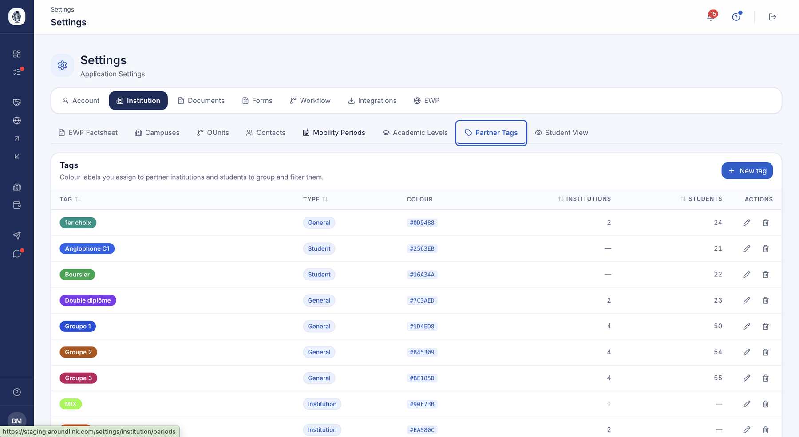

*Your tags, their scope and colour, with how many institutions and students each is applied to.*

**Use case.**
> The coordinator creates a "Double degree exchange" tag scoped to Institution,
> applies it to the twelve partners concerned, then uses it to narrow the
> destinations of a campaign.

!!! warning "Scope and campaign filters"
    A tag whose scope changes after it has been used in a campaign stops being
    taken into account there. Check your running campaigns before changing the
    scope of an existing tag.

## Student filters

**What it's for.** Describe your students with your own criteria — and, when you
choose to, make those criteria visible to your students as they search for a
destination.

**Who it's for.** RI manager / coordinator

**How it works.** A student filter carries a name and a colour, and applies to
students or to institutions. You set it from a student's record, right beside
their tags, and you find it again as a column in your lists: it sorts and filters
like its neighbours.

The difference with a tag fits in one sentence: **a tag stays with you, a student
filter shows**. Tick "Visible to students" and the value appears in "Find your
exchange", where your students pick it like a country or a language. "Match my
profile" then pre-selects the values a student already carries.

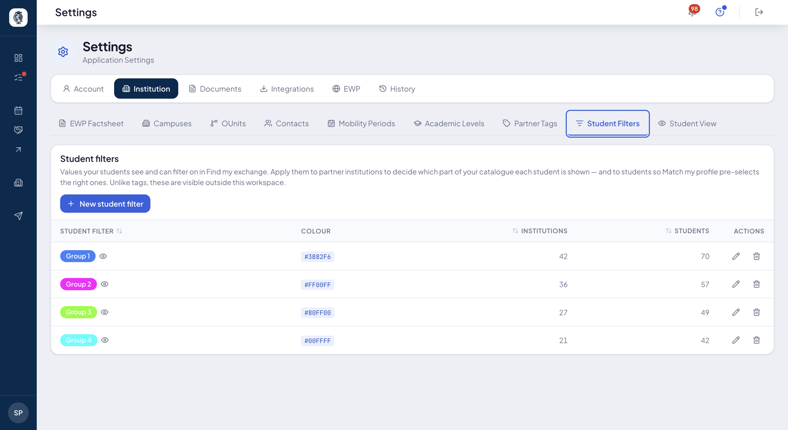

*Your filters, their colour, and how many institutions and students each is applied to.*

**Use case.**
> The coordinator creates the "Double degree" filter, applies it to the students
> concerned and makes it visible. A student carrying it opens their destination
> search: the filter is already ticked, and they only see the destinations that
> concern them.

!!! tip "Tag or student filter?"
    Ask yourself who needs to see the value. An internal point to watch, a note
    for the team, an administrative follow-up: that's a tag. A characteristic the
    student recognises and picks their destination on: that's a student filter.

## Saved views

**What it's for.** Save a table configuration (chosen columns, widths, filters,
sort order) on a given page, then reapply it in one click. Each coordinator
instantly recovers their working layout without rebuilding it every time.

**Who it's for.** RI manager

**How it works.** On a table page, you adjust the columns, filters and sort, then
save that layout as a view. You can then switch between your views in one click.
Views are private to your institution.

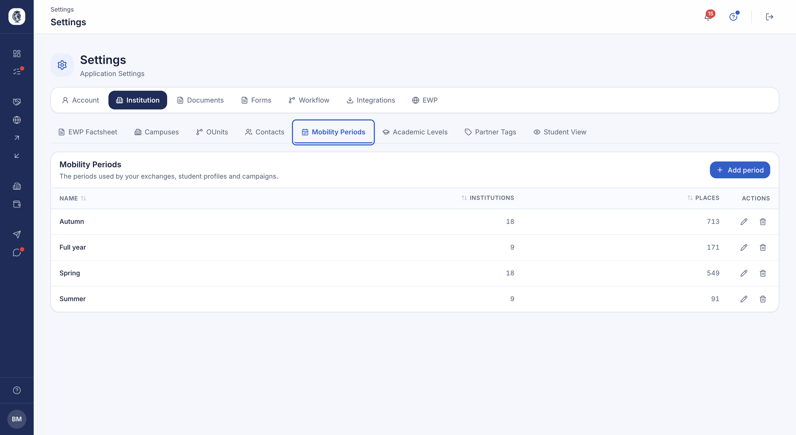

*Your periods, with how many institutions and places rely on each.*

**Use case.**
> A coordinator saves a "Spain partners — active agreements" view with its columns
> and filters, and reopens it in one click each session.

## Team & invitations

**What it's for.** Manage your office's members: prepare their accounts ahead of
time, then open access at the right moment. Ideal for a grouped start on launch
day.

**Who it's for.** admin

**How it works.** You create the team's accounts in a "pending" state, with no
email sent. When ready, you open access individually or for all pending accounts
at once: each member then receives their invitation. Sends are error-tolerant — a
single failure does not interrupt the whole batch.

**Use case.**
> During setup, the admin prepares 8 accounts (pending), then clicks "Send all
> access" on launch day.

??? note "Internal details (AroundLink team)"
    `SettingsController::team()` and access sends. Access status (pending /
    invited…). Invitations go out via a dedicated email. Each new member is also
    linked to the existing partner contacts that concern them.

## What your students see

**What it's for.** Setting two sensitive pieces of information your students see — or do
not — without changing anything for your team.

**Who it's for.** admin

**How it works.** Two switches, independent of each other.

**Ranking.** By default a student sees their rank within their promotion on their own
profile. You can hide it from them: you and your team still see it, they do not.

**Number of places.** By default your students see how many places you open on each partner
and period. You can show only that a place is available, without the number.

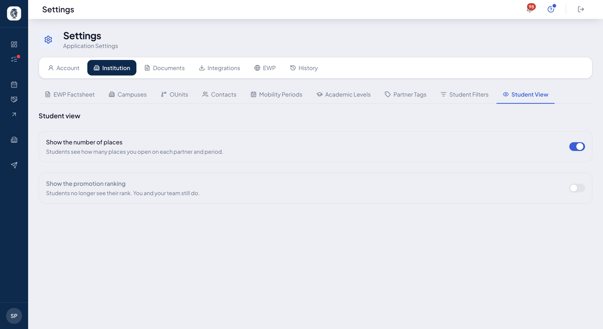

*The two switches, each with the sentence saying what the student will see.*

**Use case.**
> The institution would rather the ranking did not circulate among students before the
> committee meets. The admin hides it for the duration of the campaign and restores it
> afterwards — the coordinators saw it throughout.

## Roles & permissions

**What it's for.** Defining who can do what, and **to whom** — fitting access to your
organisation rather than to an imposed split.

**Who it's for.** admin

**How it works.** A role is built in two steps.

**First its perimeter**, meaning what it covers. Four questions, in this order: the
**business domains** concerned, the **direction** (outgoing only, incoming only, or both),
the **campuses**, the **promotions**. The lists offered are your own settings, never a
generic list. Ticking nothing on campuses or promotions means "all of them".

The domain comes first because it prunes what follows: setting rights and then finding half
of them gone would be work thrown away.

**Then its rights**, line by line, with four levels:

| Level | What it allows |
|---|---|
| **None** | Nothing. Set on a category, it closes everything inside it. |
| **View** | Consult and search. No change leaves the tool. |
| **Prepare** | Create, edit, upload — the file moves forward, inside. |
| **Decide** | Validate, refuse, send, delete, export — it leaves the tool. |

The useful boundary is this one: **"Prepare" moves a file forward inside your walls,
"Decide" sends it out**. The four levels sit side by side on each line, with no dropdown:
seeing the neighbouring value is part of the information.

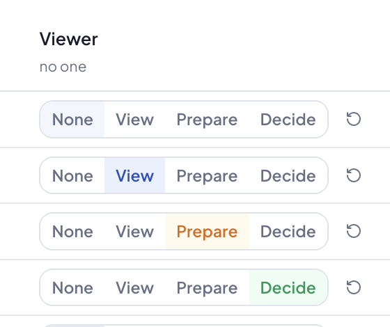

*One line of rights: the four levels aligned, the one in force in colour, and the arrow that hands the line back to what it inherits.*

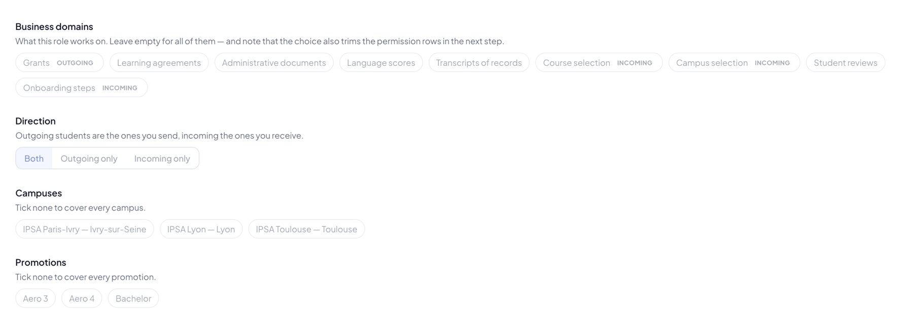

*The perimeter step: business domains, direction, campuses and promotions. Ticking nothing on campuses or promotions covers them all.*

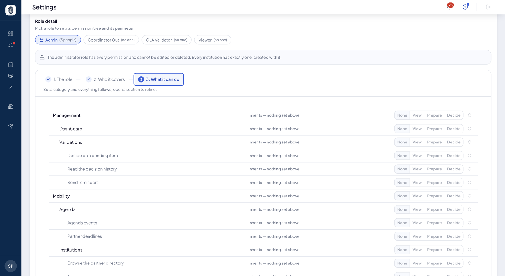

*The full tree: each section of the application, and under it the actions a role can carry.*

**Comparing two roles.** A button shows the same tree with one column per role. That is how
you answer "who can actually approve a grant?" without opening roles one by one — and how
you find out in time that nobody can, because everyone assumed someone else did.

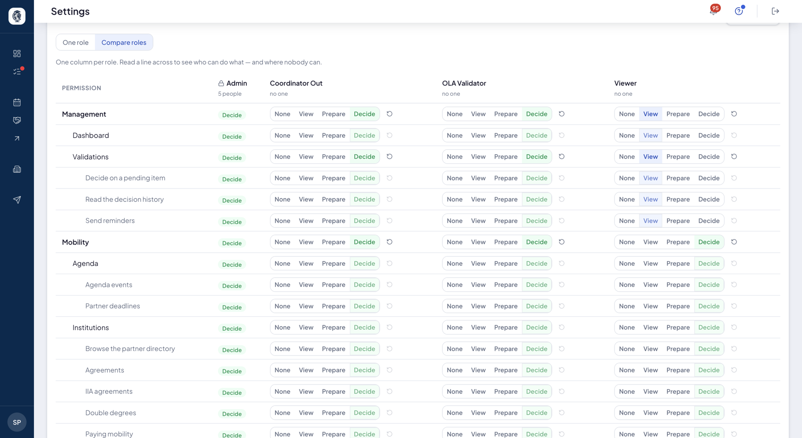

*The same tree, one column per role: you read at a glance who decides, who prepares and who sees nothing.*

**A safety net.** You cannot remove your institution's last administrator.

**What others see.** When a right is missing, the screen says so instead of pretending: a
banner announces read-only mode, and a note explains that a student is outside your
perimeter.

**Use case.**
> The manager creates an "Incoming officer" role: perimeter limited to incoming students and
> the Lyon campus, "Decide" on documents, "View" on agreements, "None" on grants.

## My permissions

**What it's for.** Seeing for yourself what you are allowed to do, and to whom.

**Who it's for.** any team member

**How it works.** The screen states your rights in plain words and recalls your perimeter.

It is behind no permission of its own, and that is deliberate: the more restricted a role,
the more the person needs to understand why a screen is closed to them. Without it, every
restriction looks like a breakdown, and someone else has to go and read their configuration
for them.

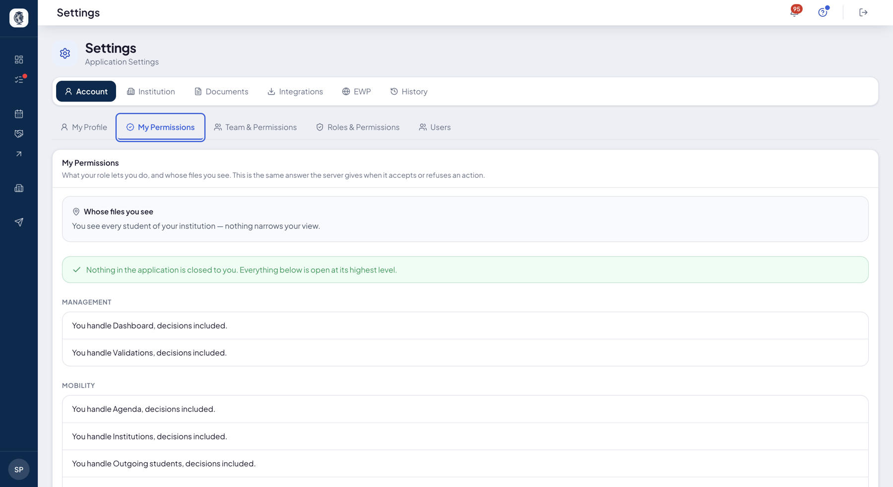

*Your rights stated as sentences — whose files you see, and what you can do in each section.*

## A contact's record

**What it's for.** Bringing together on one screen everything you know about a contact,
whether they are a person in your directory, a member of your team, or both.

**Who it's for.** RI manager / coordinator

**How it works.** A directory contact and a login account used to be two separate records
with no link between them. It is now **one contact, one page**: your contact grids and your
team list lead to the same place, and you see both their details and the state of their
access.

## User directory

**What it's for.** A read-only overview of all the users linked to your institution
— students, team members and invited partner users — filterable by type, status
and free-text search.

**Who it's for.** RI manager / admin

**How it works.** A page gathers all the organisation's users and lets you filter
them by category, status or name/email. It is reserved for paid mobility plans.

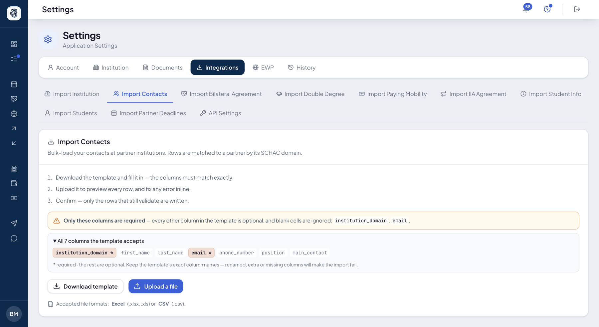

*An import: the template to download, the required columns, and the row-by-row preview before you confirm.*

**Use case.**
> The admin searches a user by email to check their status and category.

??? note "Internal details (AroundLink team)"
    `SettingsController::users()`. Read-only aggregated view built by a dedicated
    service, reserved for institutions on a paid plan.
