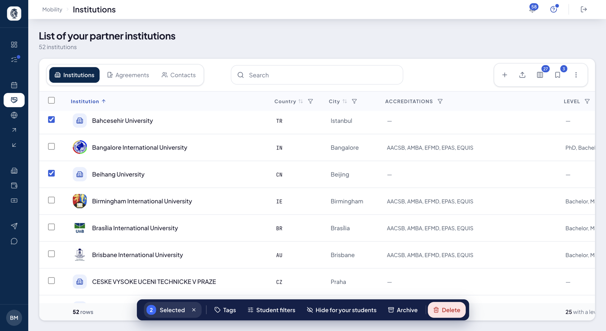
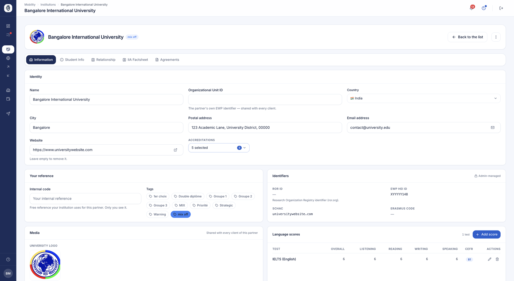
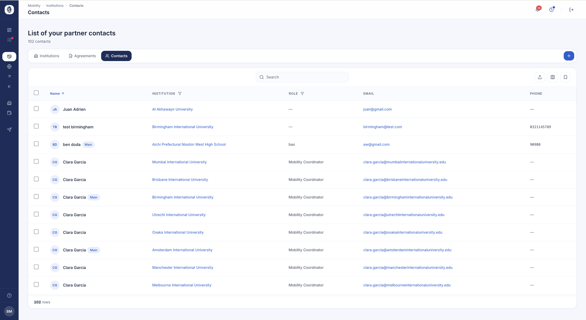
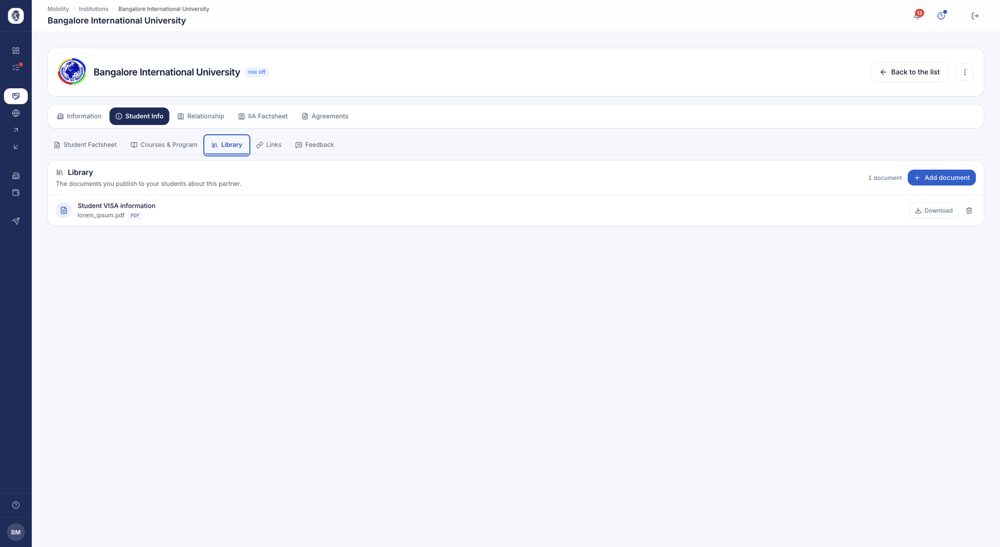
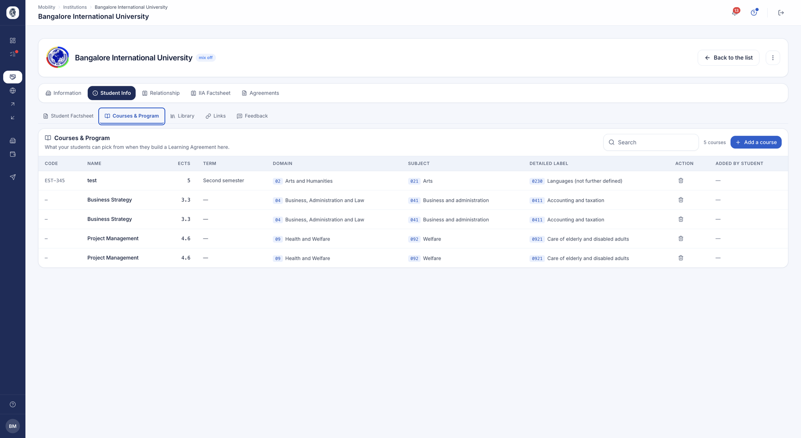

# Partenaires & fiches établissement

Le module **Partenaires** rassemble en un seul endroit tous les établissements
avec lesquels votre bureau des relations internationales travaille : où ils se
trouvent, quels accords vous lient, combien de places restent ouvertes et l'état
de leurs données officielles. Chaque partenaire dispose d'une fiche complète que
vos étudiants et votre équipe consultent tout au long de l'année.

## Annuaire des partenaires

**À quoi ça sert.** Un tableau unique et filtrable de tous vos établissements
partenaires. Il donne une vue d'ensemble immédiate — pays, ville, accréditations,
étiquettes, langues, niveaux, places restantes, nombre et type d'accords — et
sert de point d'entrée vers chaque fiche partenaire.

**Pour qui.** gestionnaire RI / coordinateur

**Comment ça marche.** L'annuaire liste les partenaires que votre établissement
suit (ceux avec qui vous avez un accord ou que vous avez créés). Vous filtrez la
liste directement depuis la barre de recherche, puis cliquez sur une ligne pour
ouvrir la fiche. Un bouton bascule le même tableau vers la vue consolidée des
accords.

*Vos partenaires, avec leur code interne, leurs accréditations, vos tags et les niveaux ouverts. Cliquez sur l'image pour l'agrandir.*

**Cas d'usage.**
> Un coordinateur filtre sur « Espagne + accords actifs », puis ouvre la fiche
> d'une université pour vérifier ses contacts.

## Créer un établissement partenaire

**À quoi ça sert.** Enregistrer un nouveau partenaire encore absent de la
plateforme, en saisissant son identité, sa localisation, ses identifiants
officiels et au moins un contact principal. Le partenaire devient aussitôt
visible dans l'annuaire et disponible pour les accords.

**Pour qui.** gestionnaire RI / coordinateur

**Comment ça marche.** **Le formulaire commence par le domaine** de l'établissement
— celui de ses adresses e-mail professionnelles. C'est lui qui identifie un
établissement de façon sûre, là où deux noms proches désignent souvent la même
école.

Avant de créer quoi que ce soit, la plateforme vérifie ce domaine et vous montre
les fiches qu'elle connaît déjà. Trois issues :

- **C'est bien lui** — vous rattachez la fiche existante à votre annuaire. Aucun
  doublon n'est créé, et vous héritez de ce qui est déjà renseigné.
- **Aucun de ceux-ci n'est mon partenaire** — votre demande part à notre équipe,
  qui complète le référentiel commun.
- **Il est inconnu** — vous le créez, avec au moins un contact principal.

À l'enregistrement, le partenaire est rattaché à votre établissement et ses
contacts sont reliés aux comptes existants qui correspondent. Vous êtes ensuite
redirigé vers la fiche complète pour poursuivre la saisie.

Seul le **nom** est obligatoire au-delà du domaine : le reste se complète au fur
et à mesure que vous l'apprenez.

**Cas d'usage.**
> Le bureau signe un nouveau partenaire au Portugal ; le coordinateur l'ajoute
> avec son code Erasmus et le coordinateur d'accueil comme contact principal.

## Fiche établissement (Informations)

**À quoi ça sert.** La carte d'identité éditable d'un partenaire : description,
accréditations, liens, étiquettes privées, code interne, logo et photo. Tout ce
que le bureau souhaite retenir sur un partenaire est centralisé ici.

**Pour qui.** gestionnaire RI / coordinateur

**Comment ça marche.** Une page réunit le formulaire d'informations, l'envoi du
logo et de la photo, ainsi que le bloc des scores de langue attendus. Les champs
descriptifs sont modifiables ; les identifiants techniques officiels restent en
lecture seule. L'enregistrement ne touche qu'à vos propres étiquettes et à votre
code interne pour ce partenaire ; les données des autres établissements sur un
partenaire partagé ne sont jamais modifiées.

*L'identité du partenaire, votre propre couche (code interne et tags), ses identifiants officiels et les scores de langue attendus.*

**Cas d'usage.**
> Le coordinateur étiquette Bologne comme « Prioritaire » et note la référence
> interne du bureau pour cet établissement.

### Étiquettes partenaires

**À quoi ça sert.** Définir vos propres libellés colorés (par exemple
« Prioritaire », « Double diplôme », « À surveiller ») et les appliquer aux
partenaires pour les regrouper et les filtrer. Les étiquettes sont privées à
l'établissement qui les crée.

**Pour qui.** gestionnaire RI / admin

**Comment ça marche.** Un écran de gestion (Paramètres ▸ Établissement) permet de
créer, modifier et supprimer des étiquettes, chacune avec un nom et une couleur.
Les étiquettes s'appliquent depuis la fiche partenaire et apparaissent en badges
et en filtres dans l'annuaire.

**Cas d'usage.**
> Le bureau crée une étiquette rouge « Suspendu » et l'applique à deux partenaires
> dont les accords ont expiré.

### Code interne du partenaire

**À quoi ça sert.** Enregistrer votre propre identifiant interne pour chaque
partenaire, distinct du code officiel, afin de faire correspondre les partenaires
à vos tableurs ou outils de gestion existants.

**Pour qui.** gestionnaire RI / coordinateur

**Comment ça marche.** Ce n'est pas un écran séparé : un simple champ sur la fiche
partenaire. Laissé vide, il efface le code ; renseigné, il crée ou met à jour une
référence propre à votre établissement. Il apparaît en colonne dans l'annuaire.

**Cas d'usage.**
> Le coordinateur enregistre la référence interne « IT-BOL-01 » pour Bologne.

### Scores de langue attendus

**À quoi ça sert.** Consigner les seuils de tests de langue qu'un partenaire
attend des étudiants entrants (par exemple IELTS 6.5, TOEFL 90, B2), sur la même
échelle que celle que les étudiants déclarent — pour comparer directement les deux
lors de la sélection.

**Pour qui.** gestionnaire RI / coordinateur

**Comment ça marche.** Un bloc de gestion (ajout, modification, suppression via
une fenêtre) sur la fiche partenaire. Chaque entrée reprend la structure des
scores étudiants : type de test, note globale, les quatre sous-scores et un
niveau CECRL optionnel.

**Cas d'usage.**
> Le coordinateur note « Lund : IELTS 6.5 / B2 » ; un étudiant à IELTS 6.0 est
> alors signalé sous le seuil.

## Contacts partenaires

**À quoi ça sert.** Un annuaire des personnes avec qui le bureau échange chez
chaque partenaire, dont un contact désigné comme principal. Ces contacts
alimentent les listes déroulantes des accords et des signataires.

**Pour qui.** gestionnaire RI / coordinateur

**Comment ça marche.** Deux entrées : une liste globale de vos contacts et un
onglet « Relation » par partenaire. Chaque contact possède nom, e-mail,
téléphone, fonction et un indicateur « principal ». À l'enregistrement, un contact
est automatiquement relié à un compte existant qui lui correspond.

*Vos interlocuteurs chez vos partenaires. C'est d'ici que vous leur ouvrez un accès à la plateforme.*

**Cas d'usage.**
> Le coordinateur ajoute la responsable Erasmus d'un partenaire et la marque
> comme contact principal.

### Ouvrir un accès au portail (invitations)

**À quoi ça sert.** Ouvrir un accès côté partenaire pour un contact, afin qu'il
collabore directement (par exemple pour approuver un accord). En un clic, le
système invite le contact, le relie à un compte existant, ou signale un conflit.

**Pour qui.** gestionnaire RI / coordinateur

**Comment ça marche.** Depuis un contact partenaire, « Ouvrir l'accès » envoie une
invitation par e-mail ; une action « Renvoyer » réémet l'invitation. Les deux
sont limitées en fréquence pour éviter les envois répétés.

**Cas d'usage.**
> Le coordinateur invite la responsable Erasmus du partenaire afin qu'elle
> examine un accord dans son propre portail.

## Vue consolidée des accords

**À quoi ça sert.** Une vue unifiée qui fusionne les accords Erasmus (IIA) et les
accords bilatéraux de tous vos partenaires, pour voir et filtrer en un seul
endroit le statut, les années de validité, la date de signature et l'état
d'approbation de chaque accord.

**Pour qui.** gestionnaire RI / coordinateur

**Comment ça marche.** Un bouton bascule l'annuaire vers cette vue normalisée, une
ligne par accord. Chaque ligne indique le partenaire, l'origine (IIA ou
bilatéral), le type, le statut (actif / inactif / résilié), l'approbation locale
et partenaire, et les années de validité.

**Cas d'usage.**
> Le bureau filtre « Tous les accords » sur « Expiré » pour planifier les
> renouvellements.

## Recherche d'établissement (autocomplétion)

**À quoi ça sert.** Accélérer la saisie en suggérant des établissements connus au
fur et à mesure de la frappe, pour rattacher partenaires et accords au bon
établissement, correctement nommé.

**Pour qui.** gestionnaire RI / coordinateur

**Comment ça marche.** Un champ propose les établissements correspondant à votre
saisie ; l'autocomplétion est intégrée aux formulaires concernés.

**Cas d'usage.**
> En tapant « sorbon », la liste suggère « Sorbonne Université » avec ses
> identifiants.

## Contenus étudiants du partenaire

**À quoi ça sert.** Composer les informations pratiques que les étudiants voient
au sujet d'un partenaire (description et blocs de contenu classés par catégorie),
pour offrir un accompagnement cohérent et validé par le bureau.

**Pour qui.** gestionnaire RI / coordinateur

**Comment ça marche.** Un éditeur avec un champ de description et l'ajout, la
modification ou la suppression de blocs de contenu classés par sous-catégorie. Un
import groupé permet aussi de charger ces contenus depuis un fichier.

**Cas d'usage.**
> Le bureau renseigne les blocs « Logement » et « Visa » d'un partenaire pour
> qu'ils apparaissent sur sa page étudiante.

## Bibliothèque de documents du partenaire

**À quoi ça sert.** Conserver les fichiers rattachés à un partenaire (accords
signés, brochures…), pour regrouper tous les documents partenaires au même
endroit.

**Pour qui.** gestionnaire RI / coordinateur

**Comment ça marche.** Vous envoyez des documents nommés à un partenaire (les noms
en double sont refusés), vous les listez et les supprimez individuellement.

*Les documents que vous publiez à vos étudiants au sujet de ce partenaire.*

**Cas d'usage.**
> Le coordinateur téléverse le PDF de l'accord de coopération signé sur la fiche
> du partenaire.

## Catalogue de cours du partenaire

**À quoi ça sert.** Tenir la liste des cours disponibles chez un partenaire pour
l'échange, afin que les étudiants et le bureau sachent ce qui peut y être étudié.

**Pour qui.** gestionnaire RI / coordinateur

**Comment ça marche.** Vous ajoutez des cours via un formulaire et vous les
supprimez par partenaire ; ils sont listés par code.

*Les cours dans lesquels vos étudiants pourront puiser pour construire leur contrat pédagogique, avec leurs crédits et leur classification.*

**Cas d'usage.**
> Le bureau enregistre les 12 cours de master enseignés en anglais qu'un
> partenaire propose aux entrants.

## FAQ du partenaire

**À quoi ça sert.** Rassembler les questions que vos étudiants posent toujours sur une
destination, et leurs réponses.

**Pour qui.** gestionnaire RI / coordinateur

**Comment ça marche.** Ce que vous voyez dépend de la nature du partenaire, et c'est le
même principe que pour sa factsheet, son catalogue de cours et sa bibliothèque :

- **Le partenaire est lui-même client d'AroundLink** — il publie sa propre FAQ, que vous
  lisez telle qu'il l'a écrite, signalée « Fournie par ce partenaire ». Elle se met à jour
  quand il la modifie, vous n'avez rien à tenir.
- **Le partenaire n'est pas client** — il ne diffuse rien, alors la FAQ est la vôtre. Vous
  l'écrivez sur lui, pour vos étudiants, et **votre établissement est seul à la voir**.

Chaque question porte sa catégorie et le public auquel elle s'adresse.

**Cas d'usage.**
> Les mêmes trois questions revenaient chaque année sur le logement à Lisbonne. La
> coordinatrice les écrit une fois dans la FAQ de la fiche ; ses étudiants les trouvent
> désormais avant de lui écrire.

## Liens web & réseaux sociaux du partenaire

**À quoi ça sert.** Enregistrer le site web et les réseaux sociaux d'un partenaire,
pour que étudiants et personnel accèdent à ses canaux officiels.

**Pour qui.** gestionnaire RI / coordinateur

**Comment ça marche.** Un formulaire édite le site web, Instagram, LinkedIn,
Twitter et Facebook, avec confirmation d'enregistrement et signalement clair en
cas d'erreur.

**Cas d'usage.**
> Le coordinateur ajoute l'Instagram d'un partenaire pour qu'il apparaisse sur la
> page étudiante.

## Modération des avis étudiants

**À quoi ça sert.** Examiner, accepter (et publier) ou refuser les avis que vos
étudiants laissent sur leur établissement d'accueil, en maîtrisant ce que les
futurs étudiants voient tout en gardant une trace de chaque décision.

**Pour qui.** gestionnaire RI / coordinateur

**Comment ça marche.** Une vue par statut (en attente / accepté / refusé) avec
compteurs. L'acceptation peut publier l'avis (visible des étudiants) ou le garder
masqué ; le refus le masque et consigne un motif. Chaque décision enregistre une
entrée d'historique avec l'auteur. Les avis se consultent à deux endroits : sur la
fiche du partenaire concerné, et dans un onglet dédié de la fiche de l'étudiant qui
les a rédigés.

**Ce que vous voyez.** Uniquement les avis rédigés par **vos** étudiants. Un avis
écrit par l'étudiant d'un autre établissement, même sur un partenaire que vous
suivez également, ne vous est jamais présenté — quel que soit son statut.

**Cas d'usage.**
> Un coordinateur lit un avis en attente, publie les avis positifs et refuse un
> avis inapproprié en indiquant un motif.

!!! info "Réservé à l'offre payante"
    La consultation et la modération des avis font partie de l'offre payante. Un
    établissement en accès gratuit n'y a pas accès.

## Aperçu côté étudiant

**À quoi ça sert.** Montrer au bureau exactement ce qu'un étudiant voit sur la page
d'un partenaire — places par catégorie, niveau et discipline, exigences, avis
publiés — pour vérifier la fiche avant que les étudiants s'y fient.

**Pour qui.** gestionnaire RI / coordinateur

**Comment ça marche.** L'aperçu affiche la page étudiante du partenaire, avec les
distributions de places réunies pour tous les types d'accords, filtrables par
année, niveau et discipline. Sans profil étudiant, les filtres démarrent sur
« Tous ».

**Cas d'usage.**
> Avant l'ouverture d'une campagne, le coordinateur prévisualise un partenaire
> pour confirmer l'affichage des places et des exigences.

## Masquer, archiver ou fusionner un partenaire

**À quoi ça sert.** Retirer de la circulation un partenaire avec lequel vous ne
travaillez plus, ou réunir deux fiches qui désignent le même établissement, sans
jamais perdre l'historique des mobilités passées.

**Pour qui.** gestionnaire RI / coordinateur

**Comment ça marche.** Trois gestes, du plus léger au plus définitif. **Masquer**
retire le partenaire de la vue de vos étudiants tout en le gardant dans vos
listes internes. **Archiver** le sort en plus de vos campagnes et de vos
décomptes de destinations. **Fusionner** réunit deux fiches en une seule : les
accords, contacts et mobilités de la fiche absorbée sont rattachés à celle que
vous conservez.

Dans les trois cas, rien n'est supprimé. Les mobilités déjà réalisées avec ce
partenaire restent consultables dans les dossiers des étudiants concernés.

**Cas d'usage.**
> Après une fusion d'universités, le coordinateur réunit les deux fiches en une
> seule ; les accords des deux se retrouvent au même endroit, sans ressaisie.

!!! warning "Accès des contacts"
    Archiver un partenaire révoque les accès que vous aviez ouverts à ses
    contacts. Ils ne peuvent plus se connecter tant que le partenaire n'est pas
    réactivé.

## Importer des établissements partenaires

**À quoi ça sert.** Charger ou actualiser en masse de nombreux partenaires depuis
un fichier Excel, avec une vérification stricte de l'en-tête pour qu'un modèle mal
rempli n'importe pas silencieusement zéro ligne.

**Pour qui.** gestionnaire RI / admin

**Comment ça marche.** Vous téléversez le fichier ; les en-têtes sont vérifiés en
amont (colonnes manquantes ou inconnues signalées) ; les lignes sont importées et
une ligne en erreur est ignorée sans bloquer les autres. Réimporter un
établissement existant actualise ses champs renseignés. Un bilan indique les
créations, mises à jour et lignes ignorées.

**Cas d'usage.**
> Le bureau téléverse 300 partenaires : 280 créés, 20 mis à jour, une faute de
> frappe dans l'en-tête détectée avant tout enregistrement.

## Importer des contacts partenaires

**À quoi ça sert.** Charger en masse des contacts partenaires depuis un fichier
CSV ou Excel, en les rattachant aux partenaires par domaine e-mail, avec un aperçu
avant écriture.

**Pour qui.** gestionnaire RI / admin

**Comment ça marche.** Vous téléversez le fichier, un aperçu s'affiche sans rien
écrire, puis vous confirmez. Une ligne en erreur est ignorée, les autres se
poursuivent. Le bilan indique les créations, mises à jour, lignes ignorées et les
domaines e-mail ne correspondant à aucun partenaire connu.

**Cas d'usage.**
> Le bureau téléverse une liste de contacts : chacun rejoint le bon partenaire, et
> 3 domaines inconnus sont signalés.

