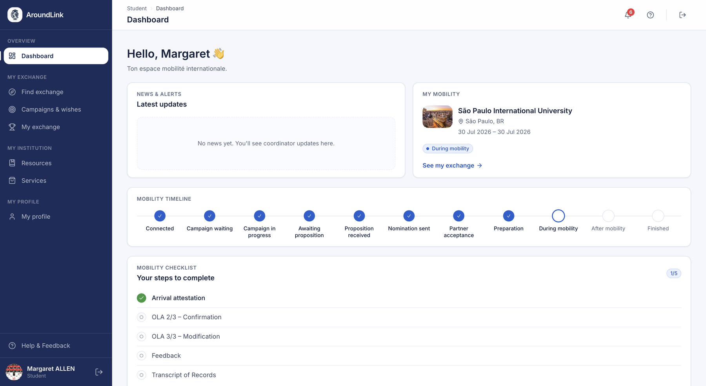
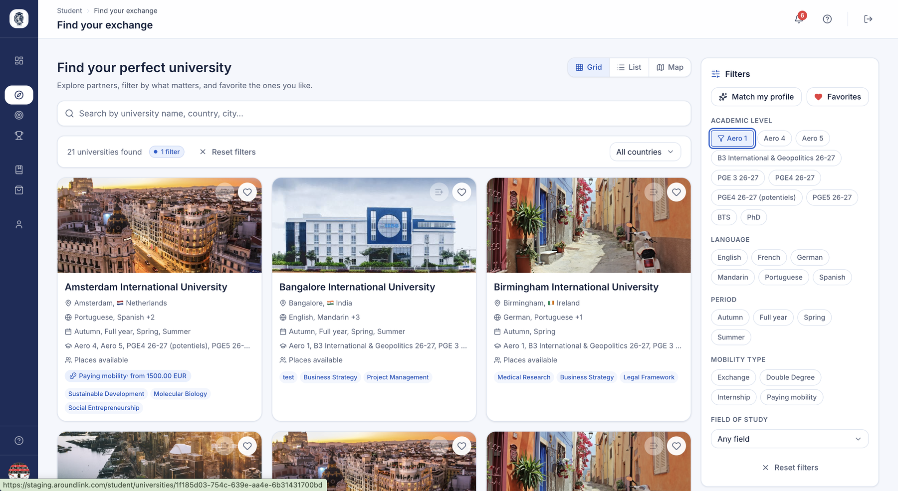
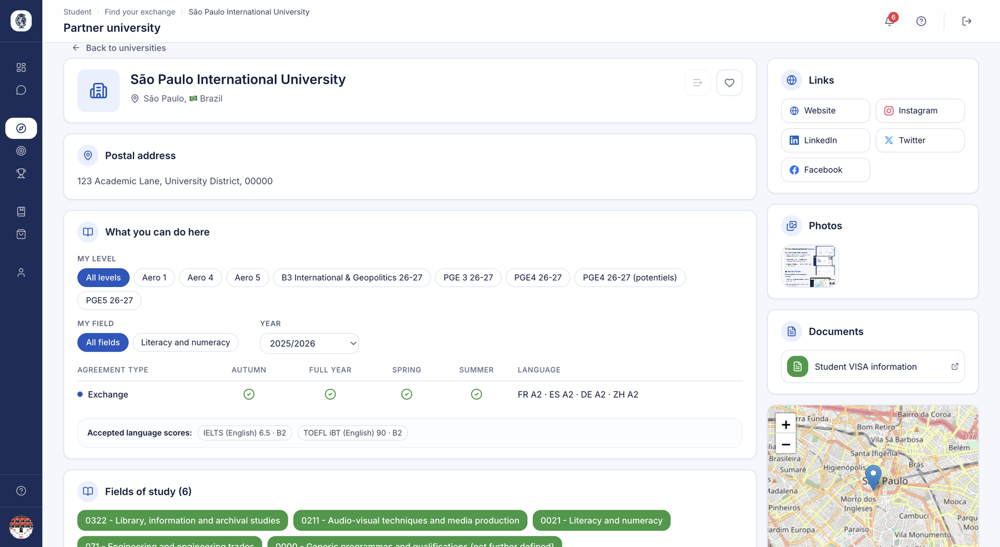
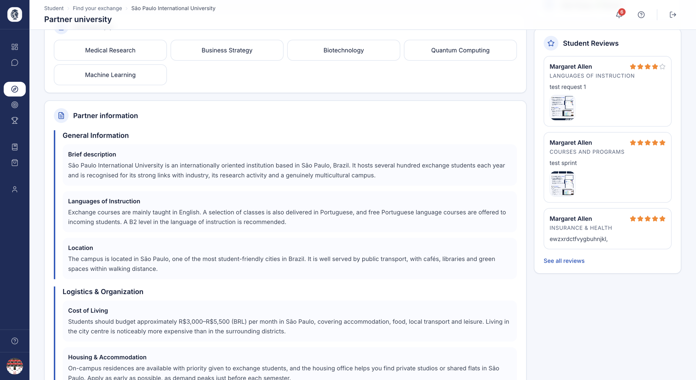
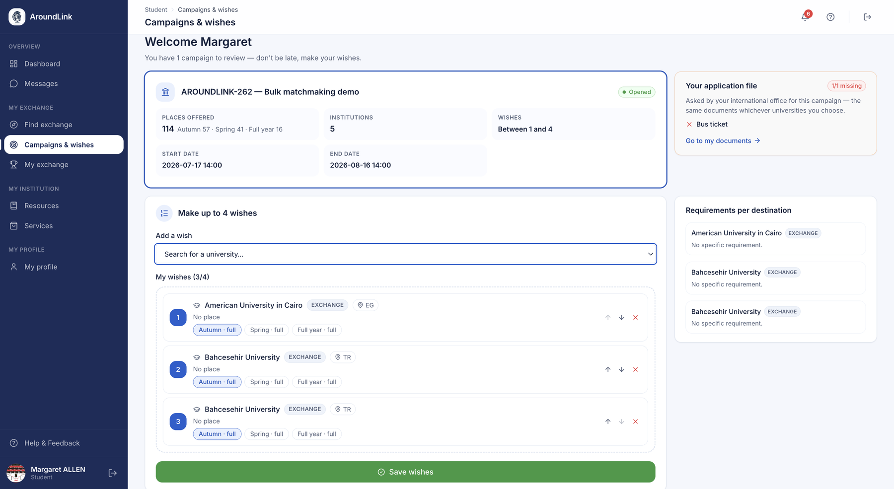

# Student portal — Discover & apply

The student portal supports every student from their first login through to
submitting their application. It brings together a journey dashboard, profile
management, a partner-university search engine and the entire campaign wish-list
flow. The goal: give students a clear, self-service experience while lightening
the international office's workload.

## Mobility dashboard

**What it's for.** This is the student's home page. It shows where they stand in
their whole mobility journey as a visual timeline, and highlights the next action
to take. Students keep an overview without needing to understand the
administrative machinery.

**Who it's for.** student

**How it works.** On each login, the portal automatically determines the
student's status and displays it on an eleven-step timeline, from "Connected" to
"Mobility completed". Each step passed is marked as completed, the current step
is highlighted and links straight to the right page. Before any placement, the
dashboard suggests a few partner universities to explore; once the student is
placed, it shows the confirmed host university and a checklist of mobility steps.

*The dashboard: their mobility timeline step by step, their confirmed destination and the list of actions still to complete.*

**Use case.**
> A student who has just submitted their wishes logs in and sees the
> "Application in progress" step highlighted, with a direct link to the campaign.

## Profile — Personal information

**What it's for.** Students manage their identity and academic details here,
reused throughout the mobility process: name, contacts, emergency number,
nationality, birth information, student number, academic level, campus and field
of study. They also manage their profile photo here.

**Who it's for.** student

**How it works.** The student fills in a profile form and can upload a photo
(PNG or JPG). The academic-level field adapts to the institution: if it has
configured its own programmes (for example "Aéro 4"), those are shown;
otherwise a generic level is offered. The field of study is based on the ISCED
classification.

**Use case.**
> Before departure, a student updates their personal email and emergency number,
> then uploads an ID photo.

## Profile — Documents & language scores

**What it's for.** This is the student's document vault. They upload the
requested administrative documents and additional files, and record their
language-test scores (with the associated certificate) required by partner
universities. Once validated by the institution, a document is locked and can no
longer be modified.

**Who it's for.** student

**How it works.** The page lists the document types required by the institution
and by the current campaign, indicates which are already uploaded and offers the
addition of extra documents. A dedicated form records a language score along with
its supporting file. The arrival and departure attestation cards also allow the
corresponding dates to be entered.

**Use case.**
> A student uploads their B2 English certificate and enters the score, then adds
> the passport copy required by the campaign.

## Profile — Mobility grant

**What it's for.** A read-only view of the mobility grants attached to the
student's exchange, so they can see the financial support awarded to them.

**Who it's for.** student

**How it works.** The tab lists the grants linked to the student's profile,
newest first. The student views the amount and status of their grant; there is
no data entry from this screen.

**Use case.**
> A student checks the amount and status of their Erasmus+ grant.

## Profile — Partner university reviews

**What it's for.** Once placed, the student can leave a review (topic, rating,
content, with optional photos) about their host university, to help future
students. They track their own reviews through moderation (Pending / Accepted /
Refused).

**Who it's for.** student

**How it works.** Students only review the institution of **their own** mobility:
the portal identifies it automatically from their placement, and without a
confirmed placement the form stays hidden behind an empty state. The topic is
picked from a detailed list — housing, courses, campus life, administrative
formalities… The review goes to moderation before any publication, and tabs
summarise the student's reviews by status.

**Use case.**
> A returning student writes a "Housing" review with two photos of the
> residence; it is sent to the coordinator for moderation.

## Find an exchange (partner search engine)

**What it's for.** This is the discovery hub: the student browses all of their
institution's partner universities, on a map and as cards, and narrows down by
period, level of study, ISCED field, mobility type, language and language level.
This is where they explore their possible destinations.

**Who it's for.** student

**How it works.** The page loads the partner universities and initialises a map.
The filters are dynamic and specific to each institution: only the periods,
fields, mobility types and languages actually present in the active agreements
are offered, covering Erasmus agreements (IIA) as well as bilateral, double-degree
and paying agreements. A "Match my profile" button pre-selects the student's
level and field. Filtering happens live, without a full page reload.

*Destination search: cards, list or world map, filters by level, language, period and mobility type, and favouriting.*

**Use case.**
> A 4th-year aerospace student clicks "Match my profile" and immediately sees
> only the partners offering their level and field for a winter semester.

## Partner university page

**What it's for.** The full page for one partner: description, documents, map,
language requirements, published reviews and — the centrepiece — a
"profile-first" table showing the available places by agreement type (Exchange /
Double degree / Paying agreement), split by period, filtered by default on the
student's level and field.

**Who it's for.** student

**How it works.** The page loads all agreements with this partner and
pre-selects the one matching the navigation context coming from the search
engine. It builds the language requirements, merges the place distributions of
the Erasmus, bilateral and double-degree agreements into a single matrix, and
displays one row per agreement type. The level, field and year remain
adjustable, and the student's profile pre-fills them. A sub-page lists all
published reviews.

*What a student sees of a destination: the places open by period and agreement type, filtered on their own level and field, the accepted language scores, the fields of study, the links and documents you published, and the location on a map.*

*Further down the same page: the practical information you wrote — description, languages of instruction, cost of living, housing — and the reviews left by students who have already been there.*

**Use case.**
> A student opens a partner's page, sees 3 study places for "Aéro 5" in the
> spring period under the exchange agreement, and reads 4 published reviews.

## Favourites

**What it's for.** The student can bookmark the partner universities that
interest them, so they can find them again quickly when building their wish list.

**Who it's for.** student

**How it works.** A toggle button adds or removes a university from favourites
and updates the list on the fly. The icon appears on the dashboard cards, the
search results and the partner pages.

**Use case.**
> A student bookmarks three institutions while browsing, then reviews their
> shortlist before building their wish list.

## Campaign wishes (application)

**What it's for.** This is the heart of the application. During an open campaign,
the student searches the eligible exchanges, builds a ranked wish list, saves it
as a draft while gathering their documents, then submits it definitively. This
is how they formally apply for their mobility places.

**Who it's for.** student

**How it works.** The page lists the campaigns the student is enrolled in.
Opening one shows their ranked wishes, a search of eligible exchanges and any
missing required documents. Saving offers two modes: draft (no blocking) and
definitive submission (which checks the exchange requirements and the presence of
required documents before accepting).

*The campaign as the student sees it: dates, how many wishes are allowed, their ranked wishes, requirements per destination and what is still missing from their file.*

**Use case.**
> A student ranks 5 choices, uploads the last required transcript, then submits
> definitively and receives a "Your wishes have been submitted" confirmation.

## Offer — Accept or decline

**What it's for.** When the institution proposes a place to the student (an
assigned wish), they see the offer and make the binding decision to accept or
decline it.

**Who it's for.** student

**How it works.** On the wishes page, the assigned offer is highlighted. Accept
and decline are two actions confirmed from a modal window. Each decision checks
that the wish belongs to the student and triggers a decision confirmation email.

**Use case.**
> A student receives an offer for their 2nd choice, clicks "Accept" in the modal,
> and receives a confirmation email.

