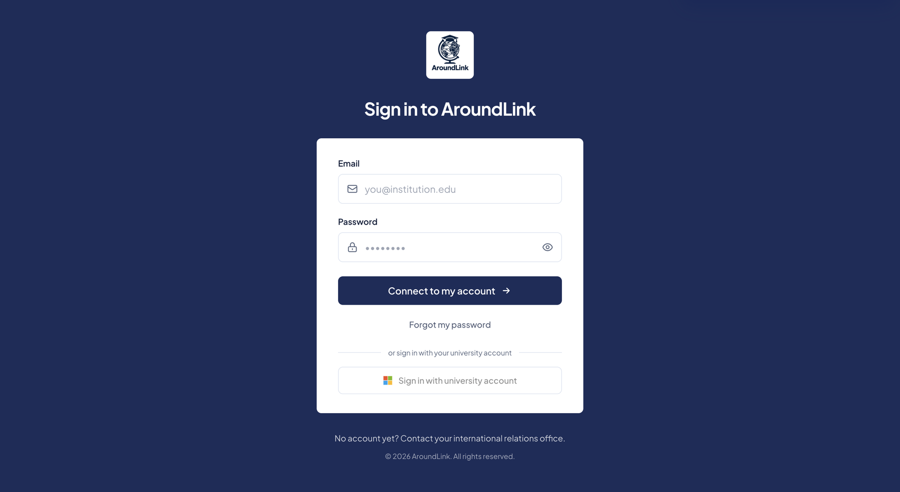

# Single sign-on (IT departments)

!!! info "Who this page is for"
    This page is **technical**: it addresses **IT departments and infrastructure
    teams** who want to know how their users sign in to AroundLink. For the
    business value, see the [Overview](plateforme.md).

AroundLink users — international office staff and students alike — can sign in
with their **institutional account**, with no extra password to create or
manage.

The connection is configured **per institution**. Each one picks its mode:
single sign-on alone, or single sign-on alongside passwords during the
transition.

## Identity providers

| Provider | Status | Guide |
| --- | --- | --- |
| **Microsoft Entra ID** (Azure AD) | ✅ Available | [Onboarding guide](sso-microsoft.md) |
| **Shibboleth / SAML 2.0** (RENATER, eduGAIN, SWITCHaai…) | 🗺️ On the roadmap | — |
| **Google Workspace** | 🗺️ On the roadmap | — |

!!! note "Roadmap"
    **Microsoft Entra ID** is the provider you can connect today. Academic
    identity federation (Shibboleth / SAML, RENATER, eduGAIN) and Google
    Workspace are on our roadmap, with no announced date at this stage.

    If your institution authenticates through one of those, do tell us: what
    institutions ask for decides the order in which we open them. In the
    meantime, password sign-in remains available, with single-use reset links —
    see [Security &amp; data](securite.md).

*The sign-in screen as your users see it: password sign-in stays available, and the button at the bottom opens authentication through the university account. Once single sign-on is enforced, only that button remains.*

## What holds for every provider

The following does not depend on the protocol. It holds for Microsoft today, and
will hold for the providers we add.

### Accounts must exist beforehand

!!! danger "The prerequisite most often discovered too late"
    Single sign-on **connects** accounts, it does not **create** them. A user who
    is absent from AroundLink is refused entry, even with a perfectly valid
    institutional account.

Accounts are created beforehand by the institution: importing the student list,
or creation by the international office. See
[Settings &amp; team](../etablissement/parametres.md).

There is **no directory synchronisation** (no SCIM) and **no group or role
synchronisation**: AroundLink permissions are granted inside AroundLink.

### The sign-in journey

1. The user types their work email address.
2. AroundLink recognises the domain and determines the institution's sign-in
   mode.
3. Depending on the configuration, they are sent to their identity provider —
   where **your** rules apply (password, MFA, conditional access) — or they type
   their AroundLink password.

There is no single sign-on button to hunt for: the email address alone routes
the user.

### Settings, per institution

| Setting | Effect |
| --- | --- |
| **Enabled** | Opens single sign-on for the institution. |
| **Strict mode** | Removes password sign-in: the identity provider becomes the only way in. |
| **Allowed email domains** | Whitelist of accepted domains, on top of the membership check. Mandatory once enabled. |

!!! warning "Do not start with strict mode"
    Strict mode removes the password fallback. Turn it on only after checking
    that at least one account really signs in through single sign-on.

### Leavers and joiners

| Event on your side | Effect in AroundLink |
| --- | --- |
| Institutional account disabled (leaver) | The person can no longer sign in, immediately. |
| Authentication rules changed (MFA, password) | Nothing to do in AroundLink: those rules are yours. |
| New joiner | Their AroundLink account must be created first. |

### AroundLink administration accounts

The vendor's internal accounts **never** sign in through a customer's single
sign-on, by design.

---

See also: [Microsoft Entra ID — onboarding guide](sso-microsoft.md) ·
[Security &amp; data](securite.md) ·
[Platform overview](plateforme.md)
